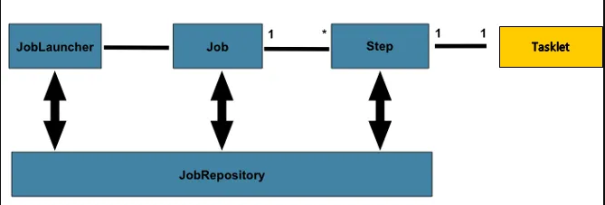
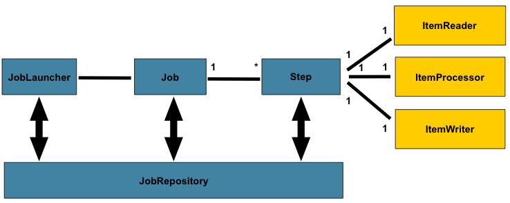
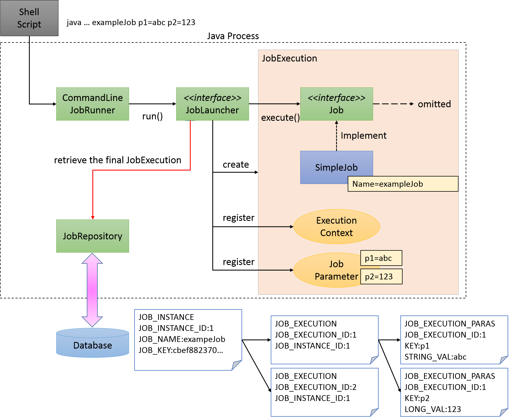
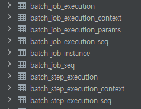

## 목표

```
스프링 배치의 구조에 대해 안다.
```

## 개발환경

| 이름 | 버전 | 비고 |
|---|---|---|
| SpringBatch | 5 | 4버전도 동일한 걸로 보인다. |

## 개요

SpringSource(Pivotal)과 Accenture가 합작해서 만든 대규모 데이터를 일괄 처리하는 배치 작업을 구현하기 쉽게 도와주는 스프링 기반의 프레임워크이다.

### 핵심 패턴

* Read - 데이터베이스, 파일, 큐에서 다량의 데이터를 조회
* Process - 특정 방법으로 데이터를 가공
* Write - 데이터를 수정된 양식으로 저장

ETL과 비슷한 처리를 함.

### 핵심 시나리오

* 배치 프로세스를 주기적으로 커밋
* 동시 다발적인 Job의 배치 처리, 대용량 병렬처리(멀티 스레드)
* 실패 후 수동 또는 스케쥴링에 의한 재시작
* 의존 관계가 있는 step 여러 개를 순차적으로 처리
* 조건적 Flow 구성을 통한 체계적이고 유연한 배치 모델 구성
* 반복, 재시도, skip 처리

## 아키텍처

기본적인 구성은 아래와 같다.  





>https://docs.spring.io/spring-batch/docs/3.0.10.RELEASE/reference/htmlsingle/

| 구성 요소       | 역할 |
|------|-----------------|
| **JobLauncher** | Job을 실행하기 위한 인터페이스이다.<br>사용자가 직접 JobLauncher를 사용할 수 있지만, 배치 프로세스는 주로 커맨드 라인에서 CommandLineJobRunner를 시작하여 실행된다. CommandLineJobRunner는 다양한 JobLauncher 시작 방법을 제공한다. |
| **JobRepository** | Job과 Step의 관리를 담당하는 시스템이다. 관리 정보는 Spring Batch에서 제공하는 스키마에 따라 데이터베이스에 저장된다. |
| **Job**         | Spring Batch 애플리케이션에서 프로세스의 일련의 단위를 요약한 단일 실행 단위이다. |
| **Step**        | 처리를 구성하는 단위이다. 하나의 Job은 1~N개의 Step을 포함할 수 있다.<br>프로세스 재사용, 병렬 처리, 조건부 분기를 통해 Job 프로세스를 여러 단계로 나눌 수 있다. Step은 chunk 모델 또는 Tasklet 모델 중 하나로 구현된다. |
| **ItemReader/ItemProcessor/ItemWriter** | 데이터를 읽고 처리하고 쓰는 세 가지 프로세스를 인터페이스로 나눈다.<br> chunk 모델을 구현할 때 주로 사용된다.  사용자는 비즈니스 로직을 정의하여 해당 역할에 따라 나눈다. |
| **ItemReader**  | 데이터 입력을 담당한다. 데이터베이스와 파일에서 Java 객체로 데이터를 변환하는 역할을 한다. |
| **ItemProcessor** | 데이터 처리 로직을 담당한다. |
| **ItemWriter**  | 데이터를 출력하는 역할을 한다.<br>데이터베이스 및 파일로 데이터를 출력한다.<br>표준 구현은 Spring Batch에서 제공된다.<br>일반적으로 데이터베이스와 파일 간의 데이터 입출력을 수행하는 프로세스를 구현하며, 표준 구현을 사용하면 쉽게 수행할 수 있다. |

## 프로세스 흐름

주요 처리 흐름은 검은색 선.  
작업 정보 저장 흐름은 빨간색 선.

<p style="background: white;"></p>
>https://terasoluna-batch.github.io/guideline/5.0.0.RELEASE/en/Ch02_SpringBatchArchitecture.html

### 처리 흐름
1. JobLauncher는 작업 스케줄러에서 시작됨.
2. Job은 JobLauncher에서 실행됨.
3. Step은 Job에서 실행됨.
4. Step은 ItemReader를 사용하여 데이터를 입력받음.
5. Step은 ItemProcessor를 사용하여 데이터를 처리함.
6. Step은 ItemWriter를 사용하여 처리된 데이터를 출력함.

### 작업 정보 저장 흐름
1. JobLauncher는 JobInstance를 JobRepository에 등록함.
2. JobLauncher는 작업 실행이 JobRepository의 데이터베이스에서 시작되었음을 등록함.
3. JobStep은 입출력 레코드 수 및 상태와 같은 기타 정보를 JobRepository의 데이터베이스에 업데이트함.
4. JobLauncher는 작업 실행이 완료되었음을 JobRepository에 등록함.

Spring Batch는 작업을 재실행하기 위해 메타데이터를 유지하는 것이 필수적이다.  
이전 실행 시점의 스냅샷은 유지되어야 하며, JobRepository는 이를 위해 기본 순서로 사용된다. 

## 메타데이터

실제 DDL스크립트를 이용해서 생성해보면 아래와 같은 테이블이 생성된다.



| 테이블                          | 엔티티 객체               | 개요 |
|--------------------------------|--------------------------|------|
| **BATCH_JOB_INSTANCE**         | JobInstance              | 작업 이름과 작업 매개변수를 직렬화하는 문자열을 유지함. |
| **BATCH_JOB_EXECUTION**        | JobExecution             | 작업 상태와 실행 결과를 유지함. |
| **BATCH_JOB_EXECUTION_PARAMS** | JobExecutionParams       | 시작 시 할당된 작업 매개변수를 유지함. |
| **BATCH_JOB_EXECUTION_CONTEXT**| JobExecutionContext      | 작업 내의 컨텍스트를 유지함. |
| **BATCH_STEP_EXECUTION**       | StepExecution            | 단계의 상태와 실행 결과, 커밋 및 롤백 횟수를 유지함. |
| **BATCH_STEP_EXECUTION_CONTEXT**| StepExecutionContext    | 단계 내의 컨텍스트를 유지함. |

SEQ는 시퀀스 생성관련 테이블임.

## 참고자료

[Spring Batch - Reference Documentation](https://docs.spring.io/spring-batch/docs/3.0.10.RELEASE/reference/htmlsingle/)  
[terasoluna-batch](https://terasoluna-batch.github.io/guideline/5.0.0.RELEASE/en/Ch02_SpringBatchArchitecture.html)  
[인프런 - 스프링배치](https://www.inflearn.com/course/%EC%8A%A4%ED%94%84%EB%A7%81-%EB%B0%B0%EC%B9%98/dashboard)