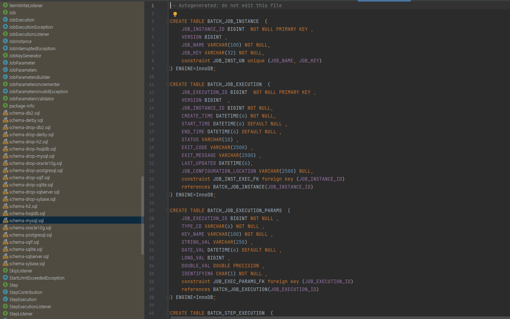

## 목표

```
스프링 배치 프로젝트 설정을 할 수 있다.
```

## 개발환경

| 이름 | 버전 | 비고 |
|---|---|---|
| SpringBoot | 2.7.6 | - |
| SpringBatch | 4.3.7 | - |
| Java | 17 | - |
| MySql | 8.0 | - |
| IntelliJ | 2024.1.4 (Ultimate Edition) | - |

## 개요

스프링 배치4를 실행해보기 위한 프로젝트의 설정 부분이다.

## 프로젝트 생성


스프링 배치4는 스프링 부트 2.7.6까지만 지원하고 스프링 부트3부터는 스프링 배치5이다.  
이 부분은 build.gradle을 수정한다.

## build.gradle 수정


```gradle
plugins {
    id 'java'
    id 'org.springframework.boot' version '2.7.6'
    id 'io.spring.dependency-management' version '1.0.15.RELEASE'
}

group = 'com.practice'
version = '0.0.1-SNAPSHOT'

java {
    toolchain {
        languageVersion = JavaLanguageVersion.of(17)
    }
}

configurations {
    compileOnly {
        extendsFrom annotationProcessor
    }
}

repositories {
    mavenCentral()
}

dependencies {
    implementation 'org.springframework.boot:spring-boot-starter-batch'
    implementation 'org.springframework.boot:spring-boot-starter-data-jpa'
    compileOnly 'org.projectlombok:lombok'
    developmentOnly 'org.springframework.boot:spring-boot-devtools'
    runtimeOnly 'com.mysql:mysql-connector-j'
    annotationProcessor 'org.projectlombok:lombok'
    testImplementation 'org.springframework.boot:spring-boot-starter-test'
    testImplementation 'org.springframework.batch:spring-batch-test'
    testRuntimeOnly 'org.junit.platform:junit-platform-launcher'
}

tasks.named('test') {
    useJUnitPlatform()
}
```

## mysql 테이블 추가
External Libraries 안에 org.springframework.batch:spring-batch-core:4.3.7이 있을 것이다.  
그 안에 배치를 감시하기 위한 테이블의 쿼리가 보존되어있으므로 해당 쿼리를 복사해서 mysql에서 실행한다.




##  application.yml 설정

디비 정보는 상황에 맞게 작성.

```yaml
spring:
  batch:
    job:
      names: ${job.name:NONE} # 외부로부터 잡 네임을 받으면 설정하기 위하여
  jpa:
    hibernate:
      ddl-auto: update
      use-new-id-generator-mappings: true
    show-sql: true
    properties:
      hibernate:
        dialect: org.hibernate.dialect.MySQL8Dialect
  datasource:
    driver-class-name: com.mysql.cj.jdbc.Driver
    url: jdbc:mysql://127.0.0.1:3306/springbatch4_practice?serverTimezone=Asia/Tokyo
    username:
    password:
logging:
  level:
    root: DEBUG
```

## Application.java 설정

@EnableBatchProcessing 어노테이션을 추가한다.

```java
@SpringBootApplication
@EnableBatchProcessing
public class SpringBatch4PracticeApplication {

    public static void main(String[] args) {
        SpringApplication.run(SpringBatch4PracticeApplication.class, args);
    }

}
```

## 테스트

### 코드

config라는 패키지를 만들고 하위의 자바 파일을 작성하였다.

```java
package com.practice.springbatch4_practice.config;

import lombok.RequiredArgsConstructor;
import org.springframework.batch.core.Job;
import org.springframework.batch.core.Step;
import org.springframework.batch.core.StepContribution;
import org.springframework.batch.core.configuration.annotation.JobBuilderFactory;
import org.springframework.batch.core.configuration.annotation.StepBuilderFactory;
import org.springframework.batch.core.scope.context.ChunkContext;
import org.springframework.batch.core.step.tasklet.Tasklet;
import org.springframework.batch.repeat.RepeatStatus;
import org.springframework.context.annotation.Bean;
import org.springframework.context.annotation.Configuration;

import java.util.ArrayList;
import java.util.List;

@Configuration
@RequiredArgsConstructor
public class TaskletJob {
    private final JobBuilderFactory jobBuilderFactory;
    private final StepBuilderFactory stepBuilderFactory;

    private String JOB_NAME = "testTaskMyJob";

    @Bean
    public Job testTaskMyJob() {
        return jobBuilderFactory.get(JOB_NAME)
                .start(testStep())
                .build();
    }

    @Bean
    public Step testStep() {
        return stepBuilderFactory.get("step1")
                .tasklet(new Tasklet() {
                    @Override
                    public RepeatStatus execute(StepContribution contribution, ChunkContext chunkContext) throws Exception {
                        List<String> items = new ArrayList<>();
                        for (int i = 1; i <= 100; i++) {
                            items.add("No." + i);
                        }
                        System.out.println(items);
                        return RepeatStatus.FINISHED;
                    }
                }).build();
    }
}

```

### 결과


결과가 제대로 출력이 되었고 테이블에도 결과가 들어간 것을 확인 할 수 있었다.

해당 코드는 아래에서 확인 가능하다.  
[gitcode](https://github.com/subCharacters/SpringBatch4_Practice/tree/practice-01-setting)  