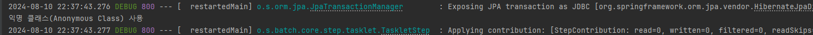
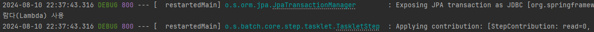
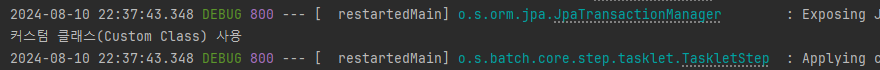

## 목표

```
스프링 배치의 tasklet을 만들 수 있다.  
tasklet은 단순한 처리에 적합하다.
```

## 개발환경

| 이름 | 버전 | 비고 |
|---|---|---|
| SpringBoot | 2.7.6 | - |
| SpringBatch | 4.3.7 | - |
| Java | 17 | - |
| MySql | 8.0 | - |
| IntelliJ | 2024.1.4 (Ultimate Edition) | - |

## 개요

스프링 배치4를 실행해보기 위한 프로젝트의 설정 부분이다.

## tasklet config파일 만들기
Tasklet의 잡을 만들때 3가지 정도로 만들 수 있다.  
익명 클래스로 만드는 법과 람다 함수를 넣어서 만드는 법, Tasklet을 상속 받아서 커스텀 클래스를 따로 구현하는법  
이중 편한데로 만들면 되고 처리가 많이 복잡할 경우엔 커스텀 클래스를 따로 만드는게 좋을 듯하다.  

```java
package com.practice.springbatch4_practice.taskjob;

import lombok.RequiredArgsConstructor;
import org.springframework.batch.core.Job;
import org.springframework.batch.core.Step;
import org.springframework.batch.core.StepContribution;
import org.springframework.batch.core.configuration.annotation.JobBuilderFactory;
import org.springframework.batch.core.configuration.annotation.StepBuilderFactory;
import org.springframework.batch.core.scope.context.ChunkContext;
import org.springframework.batch.core.step.tasklet.Tasklet;
import org.springframework.batch.repeat.RepeatStatus;
import org.springframework.context.annotation.Bean;
import org.springframework.context.annotation.Configuration;

@Configuration
@RequiredArgsConstructor
public class MyTaskletJob {
    private final JobBuilderFactory jobBuilderFactory;
    private final StepBuilderFactory stepBuilderFactory;

    private String JOB_NAME = "tasklet_Job";

    @Bean
    public Job taskletJob() {
        return jobBuilderFactory.get(JOB_NAME)
                .start(anonymousTaskletStep())
                .next(lambdaTaskletStep())
                .next(customTaskletStep())
                .build();
    }

    @Bean
    public Step anonymousTaskletStep() {
        return stepBuilderFactory.get("anonymousTaskletStep")
                .tasklet(new Tasklet() {
                    @Override
                    public RepeatStatus execute(StepContribution contribution, ChunkContext chunkContext) throws Exception {
                        System.out.println("익명 클래스(Anonymous Class) 사용");
                        return RepeatStatus.FINISHED;
                    }
                }).build();
    }

    @Bean
    public Step lambdaTaskletStep() {
        return stepBuilderFactory.get("lambdaTaskletStep")
                .tasklet((contribution, chunkContext) -> {
                    System.out.println("람다(Lambda) 사용");
                    return RepeatStatus.FINISHED;
                }).build();
    }

    @Bean
    public Step customTaskletStep() {
        return stepBuilderFactory.get("customTaskletStep")
                .tasklet(new CustomTasklet())
                .build();
    }
}

```


## CustomTasklet.java 만들기

```java
package com.practice.springbatch4_practice.taskjob;

import org.springframework.batch.core.StepContribution;
import org.springframework.batch.core.scope.context.ChunkContext;
import org.springframework.batch.core.step.tasklet.Tasklet;
import org.springframework.batch.repeat.RepeatStatus;

public class CustomTasklet implements Tasklet {
    @Override
    public RepeatStatus execute(StepContribution stepContribution, ChunkContext chunkContext) throws Exception {
        System.out.println("커스텀 클래스(Custom Class) 사용");
        return RepeatStatus.FINISHED;
    }
}

```

## 테스트
### 결과





의도된대로 결과가 잘 출력 되었다.

해당 코드는 아래에서 확인 가능하다.  
[gitcode](https://github.com/subCharacters/SpringBatch4_Practice/tree/practice-02-tasklet)  