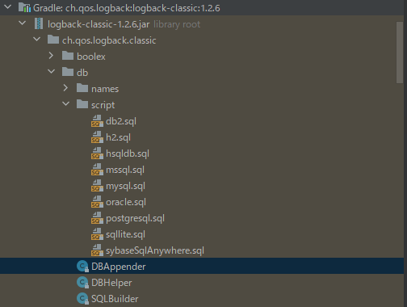

### 개요

---

<span style="font-size:13pt">
logback-spring.xml설정으로 log.error와 같이 에러 로그가 남겨질때 그 정보를 db에 저장하는 방법을 쓰려고 한다.<br>
주의할 점은 Exception일때가 아니라 error레벨로 로그를 남길때 저장이 된다는 점이다.<br>
DBappender클래스를 이용하여 정의된 스크립트로 insert하는 방법도 있지만 본 기사에서는 커스텀을 해서 자기가 만든 테이블에 로그를 저장하도록 한다.<br>
DBAppender가 제공하는 스크립트 등은 아래 장소에서 확인이 가능하니 커스텀이 싫다면 참고하면서 작성하면 될듯.<br>
</span>



### 코드

<span style="font-size:13pt">
logback.xml을 수정하기에 앞서서 커스텀할 클래스를 작성할 필요가 있다.<br>
작성을 하고 나서 DBAppender를 상속 받자.<br>
</span>

```kotlin
class ErrorLogDBAppender : DBAppender() {}
```

<span style="font-size:13pt">
그리고 DBAppender에 두가지 클래스를 오버라이드하여 가져온다.<br>
</span>

```kotlin
override fun start() {
    super.start()
    super.insertExceptionSQL = null
    super.insertPropertiesSQL = null
    super.insertSQL = null // 이 SQL 만 작성하여 사용
}

override fun subAppend(event: ILoggingEvent?, connection: Connection?, insertStatement: PreparedStatement?) {
}
```

<span style="font-size:13pt">
start와 subAppend인데 start는 super로 하여 부모 클래스를 소환한다.<br>
소환하지 않으면 해당 커스텀 클래스가 실행되지 않으니 필요.<br>
부모 클래스의 메소드가 실행될 경우 SQL들이 작성되므로 null로 다시 재정의 할 필요가 있다.<br>
sql가 null인경우 해당 쿼리는 실행하지 않는다. 다만 실행의 순서가 있는지 insertSQL이 null인 경우 그 외의 SQL 이 실행 되지 않았다.<br>
insertSQL은 밑에서 쿼리를 코딩할 예정.<br>
</span>

<span style="font-size:13pt">
logback-spring.xml 에 appender를 추가.<br>
filter는 error로그 레벨일때 실행되도록 해준다.<br>
url대신 databaseName등 바꾸어도 된다. 자세한건 DriverManagerConnectionSource 안에 파라매터를 확인.<br>
</span>

```xml
<appender name="ErrorLogDbInsert" class="com.custom.appender.ErrorLogDBAppender">
    <connectionSource class="ch.qos.logback.core.db.DriverManagerConnectionSource">
        <driverClass>com.mysql.jdbc.Driver</driverClass>
        <!--
          <springProperty scope="context" name="ERR_LOG_DB_URL" source="datasource.database.mysql-errorlog.url"/>
          <url>${ERR_LOG_DB_URL}</url>
          이런 식으로 외부 파라미터로 사용하는게 좋을듯.
        -->
        <url>jdbc:mysql://mysqldomail.com/errorlogtable</url>
        <user>admin</user>
        <password>admin+</password>
    </connectionSource>
    <filter class="ch.qos.logback.classic.filter.LevelFilter">
        <level>error</level>
        <onMatch>ACCEPT</onMatch>
        <onMismatch>DENY</onMismatch>
    </filter>
</appender>
```

<span style="font-size:13pt">
아마도 connectionSource를 아래와 같이 변경해도 될 것이다.<br>
</span>

```xml
<connectionSource class="ch.qos.logback.core.db.DataSourceConnectionSource">
     <dataSource class="com.mysql.jdbc.jdbc2.optional.MysqlDataSource">
         <url>jdbc:mysql://mysqldomail/table</url>
         <encoding>UTF-8</encoding>
         <user>user</user>
         <password>password</password>
     </dataSource>
 </connectionSource>
```

<span style="font-size:13pt">
appender에 적용이 끝났으면 springProfile에서 사용한다고 명시를 해준다.<br>
springProfile에 대한 내용은 프로젝트마다 상이 할 것이므로 맞춰서 appender내용을 선언 해줄 필요가 있음.<br>
</span>

```xml
<springProfile name="console">
    <root level="DEBUG">
        <appender-ref ref="CONSOLE"/>
        <appender-ref ref="ErrorLogDbInsert"/> <!-- errorlog관련 -->
    </root>
</springProfile>
```

<span style="font-size:13pt">
다시 ErrorLogDBAppender로 돌아와서 쿼리를 작성.<br>
</span>

```kotlin
override fun start() {
    super.start()
    super.insertExceptionSQL = null
    super.insertPropertiesSQL = null
    super.insertSQL = this.buildInsertExceptionSQL()
}

private fun buildInsertExceptionSQL(): String? {
    var builder = StringBuilder("INSERT INTO logdata ")
    builder.append("(LOGDT, LOGLEVEL, MESSAGE, THROWNMESSAGE) ")
    builder.append("VALUES (?, ?, ?, ?)")
    return builder.toString()
}
```

<span style="font-size:13pt">
작성이 됐으면 subAppend 메소드 쪽을 제작.<br>
위에 작성한 values부분에 ?에 대한 값을 넣고 execute하는 내용이다.<br>
주의 할점은 ?는 0이 첫번째가 아니라 1이 첫번째이다.<br>
트랙잭션 어노테이션으로 제어도 가능하지만 스프링부트 설정을 또 해야 해서 일단 옛날 방식으로 트라이캐치로 묶었다.<br>
</span>

```kotlin
override fun subAppend(event: ILoggingEvent?, connection: Connection?, insertStatement: PreparedStatement?) {
    try {
        if (event != null && connection != null && insertStatement != null) {
            insertStatement.setTimestamp(1, Timestamp(event.timeStamp))
            insertStatement.setString(2, event.level.toString())
            insertStatement.setString(3, event.message)
            insertStatement.setString(4, if ((event?.throwableProxy) != null) getThrown(event?.throwableProxy as ThrowableProxy) else "-")

            var executeCount = insertStatement.executeUpdate()
            if (executeCount != 1) {
                addError("Failed to insert errorLogging")
                logger.error("Failed to insert errorLogging")
                connection?.rollback()
            } else {
                connection?.commit()
            }
        }
    } catch (e: Exception) {
        addError("insert failed with exception")
        logger.error("insert failed with exception", e)
        connection?.rollback()
    } finally {
        connection?.close()
    }

}

private fun getThrown(throwableProxy: ThrowableProxy): String {
    var stackTraceArray = throwableProxy.throwable.stackTrace
    val sb = StringBuffer()
    for (stackTrace in stackTraceArray) {
        sb.append(stackTrace.toString().replace("\'", "\""))
    }

    return sb.toString()
}
```

### 전체 코드

```xml
<appender name="ErrorLogDbInsert" class="com.custom.appender.ErrorLogDBAppender">
    <connectionSource class="ch.qos.logback.core.db.DriverManagerConnectionSource">
        <driverClass>com.mysql.jdbc.Driver</driverClass>
        <url>jdbc:mysql://mysqldomail.com/errorlogtable</url>
        <user>admin</user>
        <password>admin+</password>
    </connectionSource>

    <filter class="ch.qos.logback.classic.filter.LevelFilter">
        <level>error</level>
        <onMatch>ACCEPT</onMatch>
        <onMismatch>DENY</onMismatch>
    </filter>
</appender>

<springProfile name="console">
        <root level="DEBUG">
            <appender-ref ref="CONSOLE"/>
            <appender-ref ref="ErrorLogDbInsert"/>
        </root>
 </springProfile>
```

```kotlin
class ErrorLogDBAppender : DBAppender() {
    private val logger = LoggerFactory.getLogger(this::class.java)

    override fun start() {
        super.start()
        super.insertExceptionSQL = null
        super.insertPropertiesSQL = null
        super.insertSQL = this.buildInsertExceptionSQL()
    }

    private fun buildInsertExceptionSQL(): String? {
        var builder = StringBuilder("INSERT INTO logdata ")
        builder.append("(LOGDT, LOGLEVEL, MESSAGE, THROWNMESSAGE) ")
        builder.append("VALUES (?, ?, ?, ?)")
        return builder.toString()
    }

    override fun subAppend(event: ILoggingEvent?, connection: Connection?, insertStatement: PreparedStatement?) {
        try {
            if (event != null && connection != null && insertStatement != null) {
                insertStatement.setTimestamp(1, Timestamp(event.timeStamp))
                insertStatement.setString(2, event.level.toString())
                insertStatement.setString(3, event.message)
                insertStatement.setString(4, if ((event?.throwableProxy) != null) getThrown(event?.throwableProxy as ThrowableProxy) else "-")

                var executeCount = insertStatement.executeUpdate()
                if (executeCount != 1) {
                    addError("Failed to insert errorLogging")
                    logger.error("Failed to insert errorLogging")
                    connection?.rollback()
                } else {
                    connection?.commit()
                }
            }
        } catch (e: Exception) {
            addError("insert failed with exception")
            logger.error("insert failed with exception", e)
            connection?.rollback()
        } finally {
            connection?.close()
        }

    }

    private fun getThrown(throwableProxy: ThrowableProxy): String {
        var stackTraceArray = throwableProxy.throwable.stackTrace
        val sb = StringBuffer()
        for (stackTrace in stackTraceArray) {
            sb.append(stackTrace.toString().replace("\'", "\""))
        }

        return sb.toString()
    }
}
```
