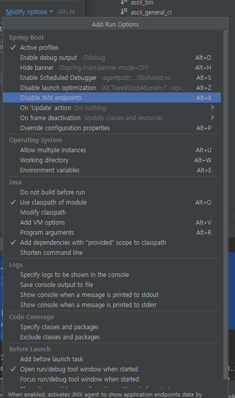

## 목표

```
javax.management.InstanceNotFoundException: org.springframework.boot:type=Admin,name=SpringApplication
	at java.management/com.sun.jmx.interceptor.DefaultMBeanServerInterceptor.getMBean(DefaultMBeanServerInterceptor.java:1083) ~[na:na]
	at java.management/com.sun.jmx.interceptor.DefaultMBeanServerInterceptor.getAttribute(DefaultMBeanServerInterceptor.java:637) ~[na:na]
	at java.management/com.sun.jmx.mbeanserver.JmxMBeanServer.getAttribute(JmxMBeanServer.java:678) ~[na:na]
	at java.management.rmi/javax.management.remote.rmi.RMIConnectionImpl.doOperation(RMIConnectionImpl.java:1443) ~[na:na]
	at java.management.rmi/javax.management.remote.rmi.RMIConnectionImpl$PrivilegedOperation.run(RMIConnectionImpl.java:1307) ~[na:na]
	at java.management.rmi/javax.management.remote.rmi.RMIConnectionImpl.doPrivilegedOperation(RMIConnectionImpl.java:1399) ~[na:na]
	at java.management.rmi/javax.management.remote.rmi.RMIConnectionImpl.getAttribute(RMIConnectionImpl.java:637) ~[na:na]
	at java.base/jdk.internal.reflect.NativeMethodAccessorImpl.invoke0(Native Method) ~[na:na]
	at java.base/jdk.internal.reflect.NativeMethodAccessorImpl.invoke(NativeMethodAccessorImpl.java:62) ~[na:na]
	at java.base/jdk.internal.reflect.DelegatingMethodAccessorImpl.invoke(DelegatingMethodAccessorImpl.java:43) ~[na:na]
	at java.base/java.lang.reflect.Method.invoke(Method.java:566) ~[na:na]
	at java.rmi/sun.rmi.server.UnicastServerRef.dispatch(UnicastServerRef.java:359) ~[na:na]
	at java.rmi/sun.rmi.transport.Transport$1.run(Transport.java:200) ~[na:na]
	at java.rmi/sun.rmi.transport.Transport$1.run(Transport.java:197) ~[na:na]
	at java.base/java.security.AccessController.doPrivileged(Native Method) ~[na:na]
	at java.rmi/sun.rmi.transport.Transport.serviceCall(Transport.java:196) ~[na:na]
	at java.rmi/sun.rmi.transport.tcp.TCPTransport.handleMessages(TCPTransport.java:562) ~[na:na]
	at java.rmi/sun.rmi.transport.tcp.TCPTransport$ConnectionHandler.run0(TCPTransport.java:796) ~[na:na]
	at java.rmi/sun.rmi.transport.tcp.TCPTransport$ConnectionHandler.lambda$run$0(TCPTransport.java:677) ~[na:na]
	at java.base/java.security.AccessController.doPrivileged(Native Method) ~[na:na]
	at java.rmi/sun.rmi.transport.tcp.TCPTransport$ConnectionHandler.run(TCPTransport.java:676) ~[na:na]
	at java.base/java.util.concurrent.ThreadPoolExecutor.runWorker(ThreadPoolExecutor.java:1128) ~[na:na]
	at java.base/java.util.concurrent.ThreadPoolExecutor$Worker.run(ThreadPoolExecutor.java:628) ~[na:na]
	at java.base/java.lang.Thread.run(Thread.java:834) ~[na:na]
 에러를 해결
```

## 개발환경

| 이름 | 버전 | 비고 |
|---|---|---|
| SpringBoot | 2.7.6 | - |
| SpringBatch | 4.3.7 | - |
| Java | 11 | - |
| MySql | 8.0 | - |
| IntelliJ | 2024.1.4 (Ultimate Edition) | - |

## 개요

스프링부트 실행 시 에러 발생.

## 원인
프로파일링 툴 jmx와 같이 기동하려는데 엔드포인트가 없어서 나는 에러이다.

## 해결
jmx실행을 비활성화 하면 된다.

Run -> Edit Configrations -> Modify options



## 결과

-

## 참고자료

-