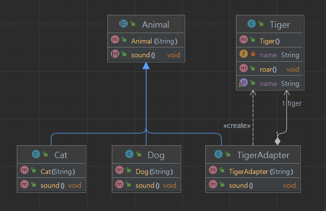

## 개요
외부 기능을 가져다 사용하려고 할 때가 있다.  
하지만 외부 기능이므로 현재 사양하고 다를 때가 있는데 그 때 어댑터를 두고 사용 가능하게 하는 패턴이다.  
한번 감싸므로 Wrapper 패턴이라고도 한다.

## 구조
### 예시 상황
동물에게 이름을 부여하고 해당 동물의 울음 소리를 내는 기능이다.  
개와 고양이의 울음 소리는 자체 구현하고 호랑이의 울음 소리는 외부 기능을 가져다 사용하라.

### UML


### 코드
#### Animal abstract class
```java
public abstract class Animal {
    protected String name;

    public Animal(String name) {
        this.name = name;
    }

    public abstract void sound();
}
```

#### Dog class
```java
public class Dog extends Animal {

    public Dog(String name) {
        super(name);
    }

    @Override
    public void sound() {
        System.out.println(name + " Barking");
    }
}
```

#### Cat class
```java
public class Cat extends Animal {

    public Cat(String name) {
        super(name);
    }

    @Override
    public void sound() {
        System.out.println(name + " Meow");
    }
}
```

#### Tiger class (외부 클래스)
```java
// 외부 클래스라 변경 못한다는 설정.
public class Tiger {
    // Cat, Dog와 다르게 생성자가 아닌 set 메소드를 통해서 설정
    private String name;

    public void setName(String name) {
        this.name = name;
    }

    public String getName() {
        return name;
    }

    // sound와 비슷한 용도의 메소드
    public void roar() {
        System.out.println("Growl");
    }
}

```

#### TigerAdapter class
```java
public class TigerAdapter extends Animal {
    private Tiger tiger;

    public TigerAdapter(String name) {
        super(name);

        tiger = new Tiger();
        tiger.setName(name);
    }

    @Override
    public void sound() {
        System.out.print(tiger.getName() + " ");
        tiger.roar();
    }
}
```

#### Main class
```java
// 어댑터 클래스는 변경할 수 없는 클래스를 인터페이스나 클래스로 사용하고자 할때 사용.
public class Main {
    public static void main(String[] args) {
        ArrayList<Animal> animals = new ArrayList<Animal>();
        animals.add(new Dog("댕댕이"));
        animals.add(new Cat("아깽이"));
        animals.add(new Cat("츄르"));
        // animals.add(new Tiger("백호")); 에러가 발생하므로 어댑터 클래스를 중간에 둔다.
        animals.add(new TigerAdapter("백호"));

        animals.forEach(animal -> {
            animal.sound();
        });

        /*
        * 댕댕이 Barking
        * 아깽이 Meow
        * 츄르 Meow
        * 백호 Growl
        */
    }
}
```

## 마무리
외부라이브러리에 있는 클래스를 가져다가 활용할때 유용한 패턴이다.
