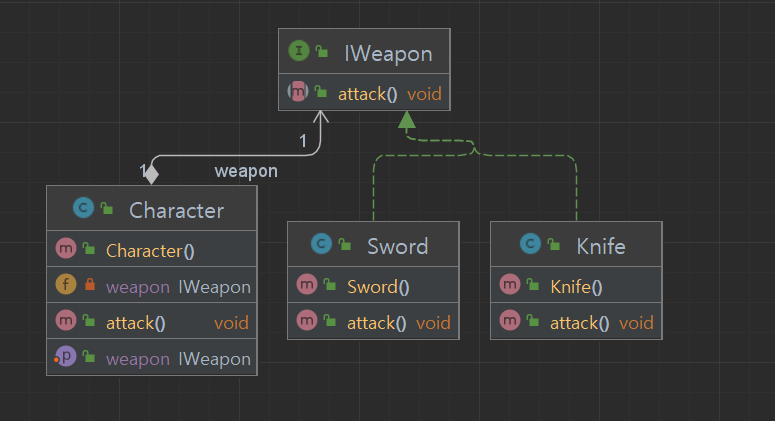

## 개요
특정 기능에 대해서 여러 전략들을 두고 이를 필요에 따라 갈아끼울 수 있도록 하는 패턴이다.  
1개의 기능이 여러 옵션을 제공할때 사용하면 좋다.

## 구조
### 예시 상황
캐릭터는 칼과 검을 장착 할 수 있다.  
무기를 장착 하지 않았을때는 맨손으로 공격한다.

### UML


### 코드
#### Weapon Interface
```java
public interface IWeapon {
    public void attack();
}
```

#### Sword class
```java
public class Sword implements IWeapon {

    @Override
    public void attack() {
        System.out.println("Sword");
    }
}
```

#### Knife class
```java
public class Knife implements IWeapon {

    @Override
    public void attack() {
        System.out.println("Knife");
    }
}
```

#### Character class
```java
public class Character {

    private IWeapon weapon;

    public void setWeapon(IWeapon weapon) {
        this.weapon = weapon;
    }

    // 델리게이트
    public void attack() {
        if (weapon == null) {
            System.out.println("fist");
        } else {
            weapon.attack();
        }
    }
}
```

#### Main class
```java
// 하나의 기능에 대해서 서로 다른 방식의 구현을 할때 전략 패턴을 사용
public class Main {
    public static void main(String[] args) {
        Character character = new Character();
        character.attack();

        character.setWeapon(new Knife());
        character.attack();

        character.setWeapon(new Sword());
        character.attack();

        /*
        * 결과
        * fist
        * Knife
        * Sword
        */
    }
}
```

### 예시 상황 (요구 사항 추가)
도끼를 추가하라.

### 추가 코드
```java
public class Axe implements IWeapon {

    @Override
    public void attack() {
        System.out.println("Axe");
    }
}
```

#### Main class
```java
// 하나의 기능에 대해서 서로 다른 방식의 구현을 할때 전략 패턴을 사용
public class Main {
    public static void main(String[] args) {
        Character character = new Character();
        character.attack();

        character.setWeapon(new Knife());
        character.attack();

        character.setWeapon(new Sword());
        character.attack();

        // 무기를 새롭게 추가할 경우 새 클래스를 만들면 추가 로직 수정없이 가능.
        character.setWeapon(new Axe());
        character.attack();

        /*
        * 결과
        * fist
        * Knife
        * Sword
        * Axe
        */
    }
}
```

## 마무리
이와 같이 한 기능에 대하여 여러 옵션이 있을 때 사용 할 수 있는 패턴이다.  
새로운 옵션이 추가 되더라도 기존 소스 코드 변경 없이 추가가 가능하다.