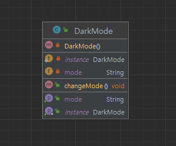

## 개요
프로세스 내에서 객체가 단 하나 존재해야 할 때 유용한 패턴이다.  
객체를 한번 생성해서 하므로 메모리를 적게 차지 하지만 객체를 공유하므로 너무 복잡한 로직을 넣거나 설계를 잘못하면 유지보수가 어려울 수 있다.

## 구조
### 예시 상황
싱글톤으로 다크모드를 구현하여 다른 기능에서 접근해도 상태가 유지 되도록 한다.

### UML


### 코드
#### DarkMode class
```java
public class DarkMode {
    private static DarkMode instance = null;

    private String mode;

    private DarkMode() {}

    public static DarkMode getInstance() {
        if (instance == null) {
            instance = new DarkMode();
            // 기본 값
            instance.mode = "light";
        }
        return instance;
    }

    public void changeMode() {
        if (mode.equals("light")) {
            mode = "dark";
        } else if (mode.equals("dark")) {
            mode = "light";
        }
    }

    public String getMode() {
        return mode;
    }
}
```

#### LoginPage class
```java
public class LoginPage {
    public void connectLoginPage() {
        System.out.println("Login Page의 모드는 " + DarkMode.getInstance().getMode());
    }
}
```

#### TopPage class
```java
public class TopPage {
    public void connectTopPage() {
        System.out.println("Top Page의 모드는 " + DarkMode.getInstance().getMode());
    }
}
```

#### Main class
```java
public class Main {
    public static void main(String[] args) {
        TopPage topPage = new TopPage();
        LoginPage loginPage = new LoginPage();

        // 톱 페이지의 접속
        topPage.connectTopPage();
        // 로그인 페이지의 접속
        loginPage.connectLoginPage();

        // 모드 변경
        DarkMode.getInstance().changeMode();

        // 톱 페이지의 접속
        topPage.connectTopPage();
        // 로그인 페이지의 접속
        loginPage.connectLoginPage();

        // 모드 변경
        DarkMode.getInstance().changeMode();

        // 톱 페이지의 접속
        topPage.connectTopPage();
        // 로그인 페이지의 접속
        loginPage.connectLoginPage();

        /*
         * Top Page의 모드는 light
         * Login Page의 모드는 light
         * Top Page의 모드는 dark
         * Login Page의 모드는 dark
         * Top Page의 모드는 light
         * Login Page의 모드는 light
         */
    }
}
```

## 마무리
changeMode()에서 하드코딩을 했지만 
싱글톤은 객체를 공유한다는 개념이므로 멀티스레드 환경에서 주의가 필요하다.  
아래는 멀티스레드 환경일때 고려할만한 코드이다.

### 이른 초기화 (Eager Initialization)
``` java
public class DarkMode {
    private static final DarkMode instance = new DarkMode();

    private DarkMode() {}

    public static DarkMode getInstance() {
        return instance;
    }
}
```

### 게으른 초기화와 synchronized 키워드 (Lazy Initialization with Synchronized)
``` java
public class DarkMode {
    private static DarkMode instance;

    private DarkMode() {}

    public static synchronized DarkMode getInstance() {
        if (instance == null) {
            instance = new DarkMode();
        }
        return instance;
    }
}
```

### 더블 체크 락킹 (Double-Checked Locking)
``` java
public class DarkMode {
    private static volatile DarkMode instance;

    private DarkMode() {}

    public static DarkMode getInstance() {
        if (instance == null) {
            synchronized (DarkMode.class) {
                if (instance == null) {
                    instance = new DarkMode();
                }
            }
        }
        return instance;
    }
}
```
