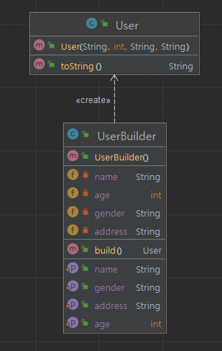

## 개요
빌더 패턴은 복잡한 구성을 가진 객체를 생성시 효과적으로 생성하는 패턴이다.  
2가지 패턴 중 지정해야할 인자가 많을 경우의 사용하면 효과적인 패턴이다.

## 구조
### 예시 상황
유저 정보의 객체를 생성하는 빌더를 만들어라.

### UML


### 코드
#### User class
```java
public class User {
    private String name;
    private int age;
    private String gender;
    private String address;

    public User(String name, int age, String gender, String address) {
        this.name = name;
        this.age = age;
        this.gender = gender;
        this.address = address;
    }

    @Override
    public String toString() {
        return "User [name=" + name + ", age=" + age + ", gender=" + gender + ", address=" + address + "]";
    }
}
```

#### UserBuilder class
```java
public class UserBuilder {
    private String name;
    private int age;
    private String gender;
    private String address;

    public UserBuilder setName(String name) {
        this.name = name;
        return this;
    }

    public UserBuilder setAge(int age) {
        this.age = age;
        return this;
    }

    public UserBuilder setGender(String gender) {
        this.gender = gender;
        return this;
    }

    public UserBuilder setAddress(String address) {
        this.address = address;
        return this;
    }

    public User build() {
        return new User(name, age, gender, address);
    }
}
```

#### Main class
```java
public class Main {
    public static void main(String[] args) {
        // 기존 생성자 방식
        User user1 = new User("User1", 20, "Male", "Seoul");
        System.out.println(user1.toString());

        // 빌더 패턴 사용
        // 생성자 방식과 달리 순서를 기억하지 않아도 된다.
        User user2 = new UserBuilder()
                .setName("User2")
                .setAge(30)
                .setGender("Female")
                .setAddress("Busan")
                .build();
        System.out.println(user2.toString());

        // 이런식으로 일부만 생성도 가능.
        User user3 = new UserBuilder()
                .setName("User3")
                .setAge(30)
                .setGender("Female")
                .build();
        System.out.println(user3.toString());

        /**
         * User [name=User1, age=20, gender=Male, address=Seoul]
         * User [name=User2, age=30, gender=Female, address=Busan]
         * User [name=User3, age=30, gender=Female, address=null]
         */
    }
}
```

## 마무리
메소드 체이닝을 이용하여 생성자에서 직접 생성하는 방식이 아니라 직관적으로 알기 쉽도록 객체를 생성하는 패턴이다.  
객체 클래스를 private로 만들고 빌더 클래스를 내부 스태틱 클래스로 만들어서 빌더 클래스를 통해서 생성되도록 캡슐화도 가능하다.  
대략적인 구조는 아래와 같이 만든다.

```java
public class User {
    // 각종 속성들
    ...
    // 외부에서 생성자를 통해서 생성하지 못하고 User.UserBuilder()를 통해서만 가능하다.
    private User(UserBuilder builder) {
        
    }

    public static class UserBuilder {
        // 각종 속성들
        ... 
        public User build() {
            return new User(this);
        }
    }
}
```