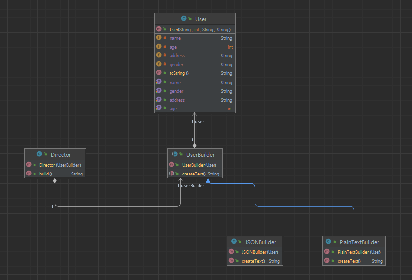

## 개요
빌더 패턴은 복잡한 구성을 가진 객체를 생성시 효과적으로 생성하는 패턴이다.  
2가지 패턴 중 객체 생서 시 여러단계를 순차적으로 거칠때 순서를 결정해두고 각 단계를 다양하게 구현 할 수 있도록 하는 패턴이다.  
상황에 맞는 객체를 생성하고 틀에 맞춰서 생성하는 것으로 스트레티지 패턴과 템플릿 패턴이 섞였다는 느낌이 있다.  
복잡해 보이지만 복잡한 처리로 생성해야하는 객체를 Director클래스를 통해 생성을 위임하고 추상클래스인 Builder(여기서는 UserBuilder)로 생성 틀을 잡는 것이다.

## 구조
### 예시 상황
유저 정보를 로그로 남길 수 있는 평문과 api로 통신 가능하도록 json형식 두가지로 빌드 패턴을 구성하라.

### UML


### 코드
#### User class
```java
public class User {
    private String name;
    private int age;
    private String gender;
    private String address;

    public User(String name, int age, String gender, String address) {
        this.name = name;
        this.age = age;
        this.gender = gender;
        this.address = address;
    }

    public String getName() {
        return name;
    }
    public void setName(String name) {
        this.name = name;
    }
    public int getAge() {
        return age;
    }
    public void setAge(int age) {
        this.age = age;
    }
    public String getGender() {
        return gender;
    }
    public void setGender(String gender) {
        this.gender = gender;
    }
    public String getAddress() {
        return address;
    }
    public void setAddress(String address) {
        this.address = address;
    }

    @Override
    public String toString() {
        return "User [name=" + name + ", age=" + age + ", gender=" + gender + ", address=" + address + "]";
    }
}
```

#### UserBuilder abstract class
```java
public abstract class UserBuilder {
    protected User user;

    public UserBuilder(User user) {
        this.user = user;
    }

    public abstract String createText();
}
```

#### PlainTextBuilder class
```java
public class PlainTextBuilder extends UserBuilder {

    public PlainTextBuilder(User user) {
        super(user);
    }

    @Override
    public String createText() {
        StringBuilder text = new StringBuilder();
        text.append("Name : ");
        text.append(user.getName());
        text.append(" ");
        text.append("Age : ");
        text.append(user.getAge());
        text.append(" ");
        text.append("Gender : ");
        text.append(user.getGender());
        text.append(" ");
        text.append("Address : ");
        text.append(user.getAddress());
        return text.toString();
    }
}
```

#### JSONBuilder class
```java
public class JSONBuilder extends UserBuilder {

    public JSONBuilder(User user) {
        super(user);
    }

    @Override
    public String createText() {
        StringBuilder text = new StringBuilder();
        text.append("\"Name\":");
        text.append("\"" + user.getName() + "\"");
        text.append(",");
        text.append("\"Age\":");
        text.append("\"" + user.getAge() + "\"");
        text.append(",");
        text.append("\"Gender\":");
        text.append("\"" + user.getGender() + "\"");
        text.append(",");
        text.append("\"Address\":");
        text.append("\"" + user.getAddress() + "\"");
        return text.toString();
    }
}
```

#### Director class
```java
public class Director {
    private UserBuilder userBuilder;

    public Director(UserBuilder userBuilder) {
        this.userBuilder = userBuilder;
    }

    public String build() {
        StringBuilder sb = new StringBuilder();
        if (userBuilder instanceof PlainTextBuilder) {
            sb.append("[Info Log] ");
            sb.append(userBuilder.createText());
            sb.append(" <-- User Info");
        } else if (userBuilder instanceof JSONBuilder) {
            sb.append("Headers: {")
                    .append("\"Content-Type\": \"application/json\", ")
                    .append("\"Accept\": \"application/json\", ")
                    .append("\"Authorization\": \"Bearer your_access_token\"")
                    .append("}\n");
            sb.append("Body: {");
            sb.append(userBuilder.createText());
            sb.append(" }");
        }
        return sb.toString();
    }
}
```

#### Main class
```java
public class Main {
    public static void main(String[] args) {
        User user = new User("User", 20, "Male", "Hawaii");
        PlainTextBuilder plainTextBuilder = new PlainTextBuilder(user);
        Director director = new Director(plainTextBuilder);
        System.out.println(director.build());

        JSONBuilder jsonBuilder = new JSONBuilder(user);
        director = new Director(jsonBuilder);
        System.out.println(director.build());

        /**
         * [Info Log] Name : User Age : 20 Gender : Male Address : Hawaii <-- User Info
         *
         * Headers: {"Content-Type": "application/json", "Accept": "application/json", "Authorization": "Bearer your_access_token"}
         * Body: {"Name":"User","Age":"20","Gender":"Male","Address":"Hawaii" }
         */
    }
}
```

## 마무리
여러 디자인 패턴들을 섞어 놓은 듯한 구성이므로 코드의 복잡도가 올라간다.  
생성을 director에서 맡고 있으므로 해당 클래스가 복잡하면 이해하기가 난해할 수 있다.