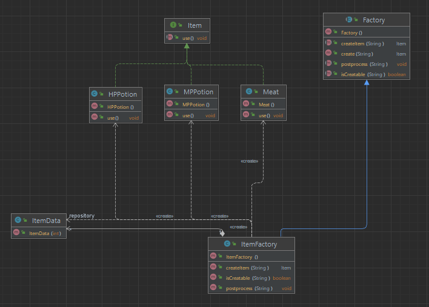

## 개요
객체 생성 패턴.  
객체의 구조와 구현을 분리한 패턴이다.  
생성 방법을 미리 정해둔 공장을 만들어두고 그 공장을 통해서 생성해 받는다.

## 구조
### 예시 상황
아이템 고기, 체력포션, 마나포션을 생성하는 로직을 만들어라.  
각각 2개 3개 4개 생성 제한이 있다.

### UML


### 코드
#### ItemData class
```java
public class ItemData {
    public int maxItemCount;
    public int currentItemCount;
    public ItemData(int maxItemCount) {
        this.maxItemCount = maxItemCount;
    }
}

```

#### Factory abstract class
```java
public abstract class Factory {
    public Item create(String name) {
        boolean isCreatable = isCreatable(name);

        if (isCreatable) {
            Item item = createItem(name);
            postprocess(name);
            return item;
        }

        return null;
    }


    public abstract boolean isCreatable(String name);

    public abstract Item createItem(String name);

     public abstract void postprocess(String name);
}
```

#### Item interface
```java
public interface Item {
    void use();
}

```

#### ItemFactory class
```java
public class ItemFactory extends Factory {
    HashMap<String, ItemData> repository;

    public ItemFactory() {
        repository = new HashMap<>();

        repository.put("Meat", new ItemData(2));
        repository.put("HPPotion", new ItemData(3));
        repository.put("MPPotion", new ItemData(4));
    }

    @Override
    public boolean isCreatable(String name) {
        ItemData itemData = repository.get(name);
        if (itemData == null) {
            System.out.println(name + " 은 존재 하지 않습니다.");
            return false;
        }

        if (itemData.currentItemCount >= itemData.maxItemCount) {
            System.out.println(name + " 은 한계치까지 소지 중입니다.");
            return false;
        }

        return true;
    }

    @Override
    public Item createItem(String name) {
        Item item = null;
        if ("Meat".equals(name)) item = new Meat();
        else if ("HPPotion".equals(name)) item = new HPPotion();
        else if ("MPPotion".equals(name)) item = new MPPotion();

        return item;
    }

    @Override
    public void postprocess(String name) {
        ItemData itemData = repository.get(name);
        if (itemData != null) itemData.currentItemCount++;
    }
}
```

#### Meat class
```java
public class Meat implements Item {
    @Override
    public void use() {
        System.out.println("use Meat");
    }
}
```

#### HPPotion class
```java
public class HPPotion implements Item {
    @Override
    public void use() {
        System.out.println("use HPPotion");
    }
}
```

#### MPPotion class
```java
public class MPPotion implements Item {
    @Override
    public void use() {
        System.out.println("use MPPotion");
    }
}
```

#### Main class
```java
public class Main {
    public static void main(String[] args) {
        Factory itemFactory = new ItemFactory();

        Item Meat1 = itemFactory.create("Meat");
        Meat1.use();
        Item Meat2 = itemFactory.create("Meat");
        Meat2.use();
        Item Meat3 = itemFactory.create("Meat");
        if (Meat3 != null) Meat3.use();
        Item Meat4 = itemFactory.create("Meat");
        if (Meat4 != null) Meat4.use();

        Item hp1 = itemFactory.create("HPPotion");
        if (hp1 != null) hp1.use();
        Item hp2 = itemFactory.create("HPPotion");
        if (hp2 != null) hp2.use();
        Item hp3 = itemFactory.create("HPPotion");
        if (hp3 != null) hp3.use();
        Item hp4 = itemFactory.create("HPPotion");
        if (hp4 != null) hp4.use();

        Item mp1 = itemFactory.create("MPPotion");
        if (mp1 != null) mp1.use();
        Item mp2 = itemFactory.create("MPPotion");
        if (mp2 != null) mp2.use();
        Item mp3 = itemFactory.create("MPPotion");
        if (mp3 != null) mp3.use();
        Item mp4 = itemFactory.create("MPPotion");
        if (mp4 != null) mp4.use();
        Item mp5 = itemFactory.create("MPPotion");
        if (mp5 != null) mp5.use();

        /***
         * use Meat
         * use Meat
         * Meat 은 한계치까지 소지 중입니다.
         * Meat 은 한계치까지 소지 중입니다.
         * use HPPotion
         * use HPPotion
         * use HPPotion
         * HPPotion 은 한계치까지 소지 중입니다.
         * use MPPotion
         * use MPPotion
         * use MPPotion
         * use MPPotion
         * MPPotion 은 한계치까지 소지 중입니다.
         */

    }
}
```

## 마무리
조금 복잡하고 어려워보이는 패턴이지만 구현과 구조를 분리하는 것이 핵심이다.  
메소드 기반으로 생성하는 패턴이다.