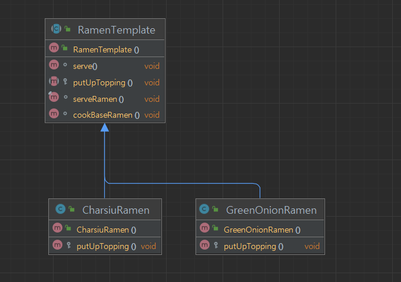

## 개요
행동 패턴 중 하나.  
기능에 대한 골격을 만들고 세부구현은 상황에 맞게 구현하도록 하는 패턴이다.  
구현사항은 자유롭게 구성할 수 있지만 반드시 순서에 따라야 할때 유용한 패턴.

## 구조
### 예시 상황
일본 라면을 만드는 기능을 구현하라.  
조리한 후 완성 된 라면에 토핑에 따라 메뉴가 달리 구성되어 있다.

### UML


### 코드
#### RamenTemplate abstract class
```java
public abstract class RamenTemplate {

    // 외부에서 변경하지 못하도록 final선언.
    final void serveRamen() {
        cookBaseRamen();
        putUpTopping();
        serve();
    }

    void cookBaseRamen() {
        System.out.println("기본 라면을 만들었습니다.");
    }

    protected abstract void putUpTopping();

    void serve() {
        System.out.println("라면을 제공했습니다.");
    }
}
```

#### CharsiuRamen class
```java
public class CharsiuRamen extends RamenTemplate {
    @Override
    protected void putUpTopping() {
        System.out.println("챠슈를 얹었습니다.");
    }
}
```

#### GreenOnionRamen class
```java
public class GreenOnionRamen extends RamenTemplate {
    @Override
    protected void putUpTopping() {
        System.out.println("파를 얹었습니다.");
    }
}
```

#### Main class
```java
public class Main {
    public static void main(String[] args) {
        RamenTemplate charsiuRamen = new CharsiuRamen();
        charsiuRamen.serveRamen();

        RamenTemplate greenOnionRamen = new GreenOnionRamen();
        greenOnionRamen.serveRamen();

        /***
         * 기본 라면을 만들었습니다.
         * 챠슈를 얹었습니다.
         * 라면을 제공했습니다.
         * 기본 라면을 만들었습니다.
         * 파를 얹었습니다.
         * 라면을 제공했습니다.
         */
    }
}
```

## 마무리
정해진 순서대로 로직을 실행해야할때 유용할 것 같다.  
실무에서 예를 들자면 OAuth로그인 로직 일 것이다.  
구글이나 X(트위터)와 같이 외부 api로 로그인 토큰을 받고 내부 회원 테이블을 참조하고 맞다면 쿠키나 세션등을 발행 하는 로직은 공통일 것이기 때문이다.