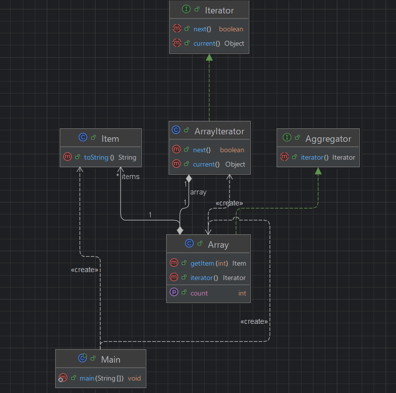

## 개요
이터레이터 패턴은 Array, LinkedList, Tree 등 다양한 컬렉션의 내부 구조를 숨기고  
hasNext()·next() 같은 공통된 Iterator API를 통해 일관되게 순회(traversal)할 수 있게 해 주는 패턴.

## 구조
### 예시 상황
배열을 커스텀 자료구조인 Iterator와 Array를 구현하여 다음이 있는지 없는지 현재값은 무엇인지를 파악하는 코드이다.  
이 형태는 이미 자바에서 구현되어 있어서 커스텀으로 할 필요는 없었을 지도 모른다.

### UML


### 코드
#### Aggregator interface
```java
public interface Aggregator {
    Iterator iterator();
}
```

#### Iterator interface
```java
public interface Iterator {
    boolean next();
    Object current();
}

```

#### Array class
```java
public class Array implements Aggregator {

    private Item[] items;

    public Array(Item[] items) {
        this.items = items;
    }

    public Item getItem(int index) {
        return items[index];
    }

    public int getCount() {
        return items.length;
    }


    @Override
    public Iterator iterator() {
        return new ArrayIterator(this);
    }
}
```

#### ArrayIterator class
```java
public class ArrayIterator implements Iterator {
    private Array array;
    private int index;

    public ArrayIterator(Array array) {
        this.array = array;
        this.index = -1;
    }

    @Override
    public boolean next() {
        index++;
        return index < array.getCount();
    }

    @Override
    public Object current() {
        return array.getItem(index);
    }
}
```

#### Item class
```java
public class Item {
    private String name;
    private int cost;

    public Item(String name, int cost) {
        this.name = name;
        this.cost = cost;
    }

    @Override
    public String toString() {
        return "(" + name + ", " + cost + ")";
    }
}
```

#### Main class
```java
public class Main {
    public static void main(String[] args) {
        Item[] items = {
                new Item("CPU", 1000),
                new Item("RAM", 2000),
                new Item("HDD", 3000),
                new Item("SSD", 4000)
        };

        Array array = new Array(items);
        Iterator iterator = array.iterator();

        while (iterator.next()) {
            Item item = (Item) iterator.current();
            System.out.println(item);
        }

        /***
         * (CPU, 1000)
         * (RAM, 2000)
         * (HDD, 3000)
         * (SSD, 4000)
         */
    }
}
```

## 마무리
자바를 예를 들자면 이미 이터레이터 클래스가 존재하고 실무에서도 next를 이용한 반복문 등 다양하게 이용하고 있다.  
이미 패턴이 적용되어 있어 직접 구현할 필요는 없겠지만 이러한 패턴이 있다라는건 기억하고 있으면 될거같다.  
혹은 필요한 기능이 있는 메서드를 추가하고 싶을때 커스텀할때 필요 할지도..?