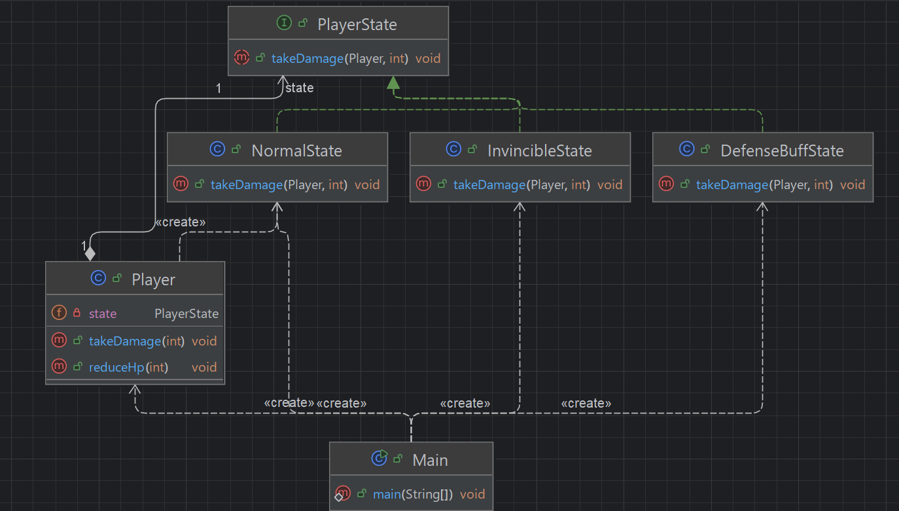

## 개요
상태를 객체화 하는 패턴  
if문을 효과적으로 줄일 수 있는 패턴이다.

## 구조
### 예시 상황
해당 예제는 캐릭터가 일반, 무적, 방업 상태일때 피격 데미지가 바뀌는 예제이다.

### UML


### 코드
#### PlayerState interface
```java
public interface PlayerState {
    void takeDamage(Player player, int damage);
}
```

#### Player class
```java
public class Player {
    private int hp = 100;
    private PlayerState state;

    public Player() {
        this.state = new NormalState(); // 초기 상태
    }

    public void setState(PlayerState state) {
        this.state = state;
        System.out.println("➡ 상태 변경: " + state.getClass().getSimpleName());
    }

    public void takeDamage(int amount) {
        state.takeDamage(this, amount);
        System.out.println("❤️ 현재 HP: " + hp);
        System.out.println();
    }

    public void reduceHp(int amount) {
        hp -= amount;
        if (hp < 0) hp = 0;
    }
}
```

#### NormalState class
```java
public class NormalState implements PlayerState {
    @Override
    public void takeDamage(Player player, int damage) {
        player.reduceHp(damage);
        System.out.println("일반 상태: " + damage + " 피해를 입음" );
    }
}
```

#### InvincibleState class
```java
public class InvincibleState implements PlayerState{
    @Override
    public void takeDamage(Player player, int damage) {
        System.out.println("무적 상태: " + 0 + " 피해를 입음" );
    }
}

```

#### DefenseBuffState class
```java
public class DefenseBuffState implements PlayerState {
    @Override
    public void takeDamage(Player player, int damage) {
        int reduced = damage / 2;
        player.reduceHp(reduced);
        System.out.println("일반 상태: " + reduced + " 피해를 입음" );
    }
}
```

#### Main class
```java
public class Main {
    public static void main(String[] args) {
        Player player = new Player();
        int damage = 10;

        player.takeDamage(damage); // 일반 상태

        player.setState(new InvincibleState());
        player.takeDamage(damage); // 무적 상태

        player.setState(new DefenseBuffState());
        player.takeDamage(damage); // 방어 버프 상태

        player.setState(new NormalState());
        player.takeDamage(damage); // 다시 일반 상태

        /***
         * 일반 상태: 10 피해를 입음
         * ❤️ 현재 HP: 90
         * ➡ 상태 변경: InvincibleState
         * 무적 상태: 0 피해를 입음
         * ❤️ 현재 HP: 90
         * ➡ 상태 변경: DefenseBuffState
         * 일반 상태: 5 피해를 입음
         * ❤️ 현재 HP: 85
         * ➡ 상태 변경: NormalState
         * 일반 상태: 10 피해를 입음
         * ❤️ 현재 HP: 75
         * 
         */
    }
}
```

## 마무리
현재 객체의 상태에 따라서 같은 메서드이지만 다른 처리가 가능하다.  
여기에는 게임에 적용해 보았지만 결제 시스템에서 같은 payment이지만 결제 방식의 state가 QR코드 결제방식인지 카드인지 등에 따라 나뉘도록 하는 등 다양한 응용이 가능하다.