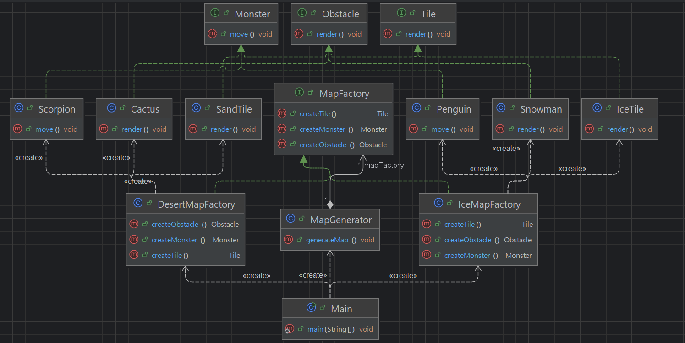

## 개요
구성될 컴포넌트들은 명확하지만 상세가 정해지지 않을 때 사용하는 패턴.  
예를 들어 GUI의 경우 버튼과 입력칸, 체크박스등은 필요하지만, 모바일UI인지 맥UI인지등 정해지지 않았을때 등이다.

## 구조
### 예시 상황
예제는 맵을 테마별로 생성하는 예제이다.

### UML


### 코드
#### Obstacle interface
```java
public interface Obstacle {
    void render();
}
```

#### Monster interface
```java
public interface Monster {
    void move();
}
```

#### Tile interface
```java
public interface Tile {
    void render();
}
```

#### MapFactory interface
```java
public interface MapFactory {
    Tile createTile();
    Obstacle createObstacle();
    Monster createMonster();
}
```

#### Cactus class
```java
public class Cactus implements Obstacle {
    @Override
    public void render() {
        System.out.println("선인장 생성");
    }
}
```

#### SandTile class
```java
public class SandTile implements Tile {
    @Override
    public void render() {
        System.out.println("모래 타일 생성");
    }
}
```

#### Scorpion class
```java
public class Scorpion implements Monster {
    @Override
    public void move() {
        System.out.println("스콜피온 이동");
    }
}
```

#### IceTile class
```java
public class IceTile implements Tile {
    @Override
    public void render() {
        System.out.println("얼음 타일 생성");
    }
}
```

#### Penguin class
```java
public class Penguin implements Monster {
    @Override
    public void move() {
        System.out.println("펭귄 이동");
    }
}
```

#### Snowman class
```java
public class Snowman implements Obstacle {
    @Override
    public void render() {
        System.out.println("눈사람 생성");
    }
}
```

#### DesertMapFactory class
```java
public class DesertMapFactory implements MapFactory {
    @Override
    public Tile createTile() {
        return new SandTile();
    }

    @Override
    public Obstacle createObstacle() {
        return new Cactus();
    }

    @Override
    public Monster createMonster() {
        return new Scorpion();
    }
}
```

#### IceMapFactory class
```java
public class IceMapFactory implements MapFactory{
    @Override
    public Tile createTile() {
        return new IceTile();
    }

    @Override
    public Obstacle createObstacle() {
        return new Snowman();
    }

    @Override
    public Monster createMonster() {
        return new Penguin();
    }
}
```

#### MapGenerator class
```java
public class MapGenerator {
    private final MapFactory mapFactory;

    public MapGenerator(MapFactory mapFactory) {
        this.mapFactory = mapFactory;
    }

    public void generateMap() {
        Tile tile = mapFactory.createTile();
        Obstacle obstacle = mapFactory.createObstacle();
        Monster monster = mapFactory.createMonster();

        tile.render();
        obstacle.render();
        monster.move();
    }
}
```

#### Main class
```java
public class Main {
    public static void main(String[] args) {
        System.out.println("🏜️ 사막 맵 생성 중...");
        MapGenerator desertMap = new MapGenerator(new DesertMapFactory());
        desertMap.generateMap();

        System.out.println("\n❄️ 얼음 맵 생성 중...");
        MapGenerator iceMap = new MapGenerator(new IceMapFactory());
        iceMap.generateMap();

        /***
         * 🏜️ 사막 맵 생성 중...
         * 모래 타일 생성
         * 선인장 생성
         * 스콜피온 이동
         * 
         * ❄️ 얼음 맵 생성 중...
         * 얼음 타일 생성
         * 눈사람 생성
         * 펭귄 이동
         */
    }
}
```

## 마무리
컴포넌트를 조합해서 완성품을 만든다고 생각하면 편할듯.