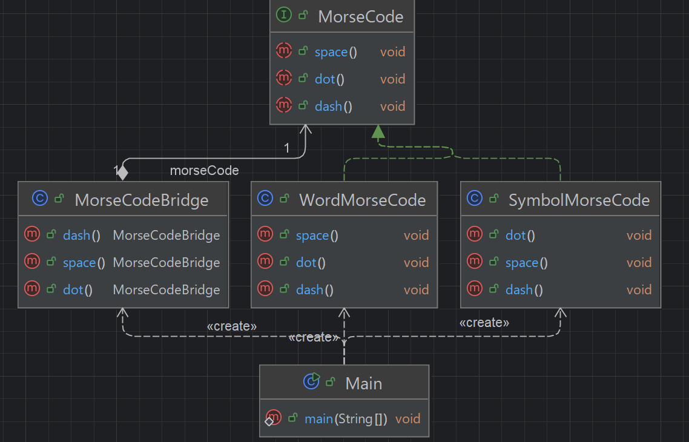

## 개요
추상화 계층과 구현 계층의 분리로 시스템의 확장성과 유지보수성을 높이는 패턴.  
예를 들어 도형이 있고 색을 칠하는 기능이 있다고 가정 했을때 추상화 부분으로 도형을 그리고 구현부에서 색을 칠하는 방식으로 나누는 개념이다.

## 구조
### 예시 상황
모스부호에 대한 예제이다.  
모스 부호의 문자(dot인지 dash인지 space인지)에 대한 추상화와 기능(기호 혹은 영단어 출력)을 따로 나타내었다.

### UML


### 코드
#### MorseCode interface
```java
public interface MorseCode {
    void dot();
    void dash();
    void space();
}
```

#### MorseCodeBridge class
```java
public class MorseCodeBridge {
    private MorseCode morseCode;

    public MorseCodeBridge(MorseCode morseCode) {
        this.morseCode = morseCode;
    }

    public MorseCodeBridge dot() {
        morseCode.dot();
        return this;
    }

    public MorseCodeBridge dash() {
        morseCode.dash();
        return this;
    }

    public MorseCodeBridge space() {
        morseCode.space();
        return this;
    }
}
```

#### SymbolMorseCode class
```java
public class SymbolMorseCode implements MorseCode {
    @Override
    public void dot() {
        System.out.print("・");
    }

    @Override
    public void dash() {
        System.out.print("-");
    }

    @Override
    public void space() {
        System.out.print(" ");
    }
}
```

#### WordMorseCode class
```java
public class WordMorseCode implements MorseCode {
    @Override
    public void dot() {
        System.out.print("DOT");
    }

    @Override
    public void dash() {
        System.out.print("DASH");
    }

    @Override
    public void space() {
        System.out.print(" ");
    }
}

```

#### Main class
```java
public class Main {
    public static void main(String[] args) {
        MorseCodeBridge bridge = new MorseCodeBridge(new SymbolMorseCode());
        bridge.dot().dot().dot().space().dash().dash().dash().space().dot().dot().dot();

        System.out.println();

        bridge = new MorseCodeBridge(new WordMorseCode());
        bridge.dot().dot().dot().space().dash().dash().dash().space().dot().dot().dot();

        /***
         * ・・・ --- ・・・
         * DOTDOTDOT DASHDASHDASH DOTDOTDOT
         */
    }
}
```

## 마무리
아직 와닿게 써본적이 없어서 잘 모르겠으나 확장성을 봤을때 요긴하게 사용은 가능 할 것 같다.