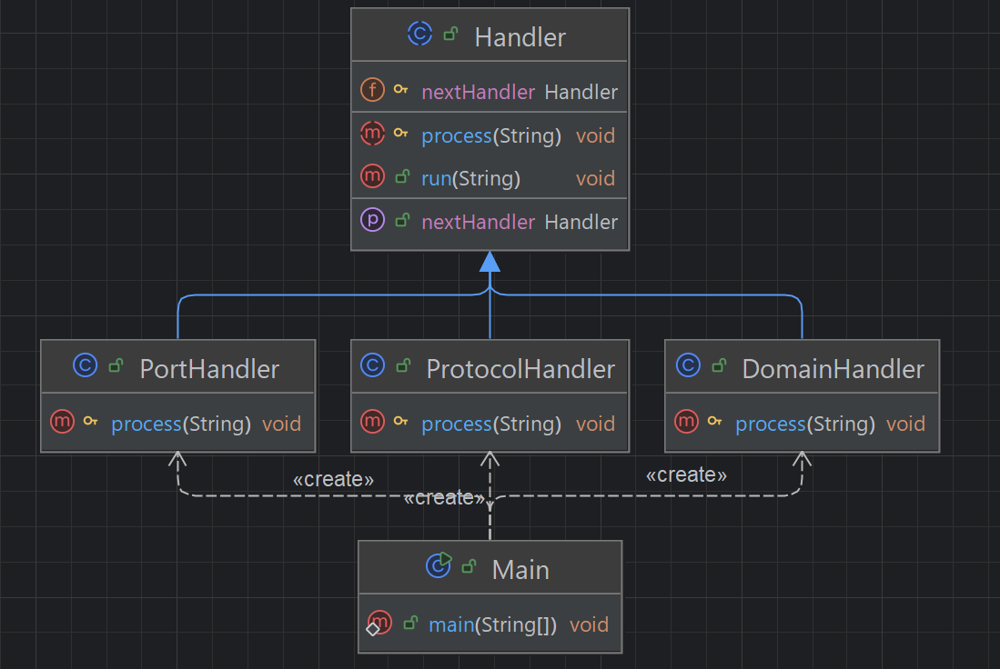

## 개요
여러개의 책임들을 동적으로 연결해서 순차적으로 실행하는 패턴.  
기능을 클래스별로 분리해석 구현.

## 구조
### 예시 상황
URL 분석 -> 프로토콜 책임 -> 도메인 책임 -> 포트 책임으로 연결하였다.

### UML


### 코드
#### Handler abstract class
```java
public abstract class Handler {
    protected Handler nextHandler;

    // 다음 책임을 지정하는 메서드
    public Handler setNextHandler(Handler nextHandler) {
        this.nextHandler = nextHandler;
        return nextHandler;
    }

    // 구체적인 프로세스. 자식에서만 접근 가능하도록 protected
    protected abstract void process(String url);

    public void run(String url) {
        process(url);
        if (nextHandler != null) {
            nextHandler.run(url);
        }
    }
}
```

#### DomainHandler class
```java
public class DomainHandler extends Handler {

    @Override
    protected void process(String url) {
        int startIndex = url.indexOf("://");
        int lastIndex = url.lastIndexOf(":");

        System.out.print("DOMAIN:");
        if (startIndex == -1) {
            if (lastIndex == -1) {
                System.out.println(url);
            } else {
                System.out.println(url.substring(0, lastIndex));
            }
        } else if (startIndex != lastIndex) {
            System.out.println(url.substring(startIndex + 3, lastIndex));
        } else if (startIndex == lastIndex) {
            System.out.println(url.substring(startIndex + 3));
        } else {
            System.out.println("NONE");
        }
    }
}
```

#### PortHandler class
```java
public class PortHandler extends Handler {
    @Override
    protected void process(String url) {
        int index = url.lastIndexOf(":");
        if (index != -1) {
            String strPort = url.substring(index + 1);
            int port = Integer.parseInt(strPort);
            System.out.println("PORT: " + port);
            return;
        }

        System.out.println("NO PORT");
    }
}
```

#### ProtocolHandler class
```java
public class ProtocolHandler extends Handler {
    @Override
    protected void process(String url) {
        int index = url.indexOf("://");
        if(index != -1) {
            System.out.println("PROTOCOL: " + url.substring(0, index));
        } else {
            System.out.println("NO PROTOCOL");
        }
    }
}
```

#### Main class
```java
public class Main {
    public static void main(String[] args) {
        Handler handler1 = new ProtocolHandler();
        Handler handler2 = new PortHandler();
        Handler handler3 = new DomainHandler();

        handler1.setNextHandler(handler2).setNextHandler(handler3);

        String url = "http://www.google.com:8080";
        System.out.println("INPUT: " + url);

        handler1.run(url);

        /***
         * INPUT: http://www.google.com:8080
         * PROTOCOL: http
         * PORT: 8080
         * DOMAIN:www.google.com
         */
    }
}
```

## 마무리
스프링 세큐리티에서도 체이닝 사용하는 패턴이다.  
if 문을 이용하여 조건에 맞으면 return으로 끝내거나 할때 사용하면 좋다.  
if를 극적으로 줄이고 핸들러에 등록하는 것으로 끝나기 때문이다.