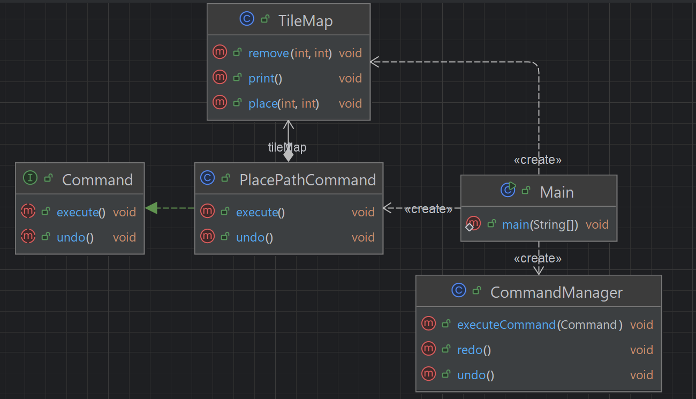

## 개요
명령을 객체로 만들어 캡슐화 하여 요청자와 실행자를 분리하는 패턴  
Undo/Redo, 명령 큐, 로그 기록 등에 유용하다.  
해당 패턴의 특성상 

## 구조
### 예시 상황
맵의 특정 좌표를 표시하고 undo와 redo가 가능하도록 한다.

### UML


### 코드
#### Command interface
```java
public interface Command {
    void execute();
    void undo();
}
```

#### CommandManager class
```java
// 명령 실행과 관리
public class CommandManager {
    private final Stack<Command> undoStack = new Stack<Command>();
    private final Stack<Command> redoStack = new Stack<Command>();

    // 실행하면 undo에는 넣고, redo는 클리어 
    public void executeCommand(Command command) {
        command.execute();
        undoStack.push(command);
        redoStack.clear();
    }

    // undo를 실행하면 undo가 비어있지 않으면 undo를 실행하고
    // 다시 redo를 해야 하기에 redo에도 추가.
    public void undo() {
        if (!undoStack.isEmpty()) {
            Command command = undoStack.pop();
            command.undo();
            redoStack.push(command);
        }
    }

    // undo의 반대
    public void redo() {
        if (!redoStack.isEmpty()) {
            Command command = redoStack.pop();
            command.execute();
            undoStack.push(command);
        }
    }
}
```

#### PlacePathCommand class
```java
// 타일에 경로 놓기
public class PlacePathCommand implements Command {
    private final TileMap tileMap;
    private final int x, y;

    public PlacePathCommand(TileMap tileMap, int x, int y) {
        this.tileMap = tileMap;
        this.x = x;
        this.y = y;
    }

    @Override
    public void execute() {
        tileMap.place(x, y);
    }

    @Override
    public void undo() {
        tileMap.remove(x, y);
    }
}
```

#### TileMap class
```java
// 실제 맵
public class TileMap {
    private final String[][] map;
    public TileMap(int width, int height) {
        map = new String[height][width];
        for (int i = 0; i < height; i++)
            for (int j = 0; j < width; j++)
                map[i][j] = " ";
    }

    public void place(int x, int y) {
        map[y][x] = "X";
    }

    public void remove(int x, int y) {
        map[y][x] = " ";
    }

    public void print() {
        for (String[] row : map) {
            for (String cell : row) {
                System.out.print("[" + cell + "]");
            }
            System.out.println();
        }
        System.out.println();
    }
}
```

#### Main class
```java
public class Main {
    public static void main(String[] args) {
        // 맵 크기 생성
        TileMap map = new TileMap(5, 3);
        // 관리자 생성
        CommandManager manager = new CommandManager();

        manager.executeCommand(new PlacePathCommand(map, 1, 1));
        manager.executeCommand(new PlacePathCommand(map, 2, 1));
        manager.executeCommand(new PlacePathCommand(map, 3, 1));
        map.print();

        System.out.println("Undo");
        manager.undo();
        map.print();

        System.out.println("Undo");
        manager.undo();
        map.print();

        System.out.println("Undo");
        manager.undo();
        map.print();

        System.out.println("Redo");
        manager.redo();
        map.print();

        System.out.println("Redo");
        manager.redo();
        map.print();

        /***
         * [ ][ ][ ][ ][ ]
         * [ ][X][X][X][ ]
         * [ ][ ][ ][ ][ ]
         * 
         * Undo
         * [ ][ ][ ][ ][ ]
         * [ ][X][X][ ][ ]
         * [ ][ ][ ][ ][ ]
         * 
         * Undo
         * [ ][ ][ ][ ][ ]
         * [ ][X][ ][ ][ ]
         * [ ][ ][ ][ ][ ]
         * 
         * Undo
         * [ ][ ][ ][ ][ ]
         * [ ][ ][ ][ ][ ]
         * [ ][ ][ ][ ][ ]
         * 
         * Redo
         * [ ][ ][ ][ ][ ]
         * [ ][X][ ][ ][ ]
         * [ ][ ][ ][ ][ ]
         * 
         * Redo
         * [ ][ ][ ][ ][ ]
         * [ ][X][X][ ][ ]
         * [ ][ ][ ][ ][ ]
         * 
         */
    }
}
```

## 마무리
큐를 이용해서 undo와 redo가 가능하다.  
게임에서 건설에 관련된 기능이나 텍스트 툴등에서 많이 사용된다고 한다.