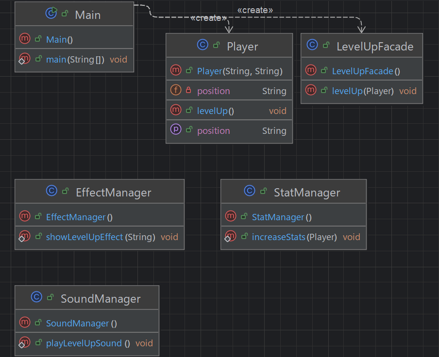

## 개요
여러 객체의 복잡한 흐름을 숨기고 입구 하나로 통합된 간단한 메서드를 제공하는 패턴.  
예를 들어 게임에서 레벨업을 하면 레벨업 효과음, 이펙트, 스탯 증가, 애니메이션 재생이 필요하다면  
해당 메서드를 하나로 모아서 레벨업이라는 메서드를 따로 만들면 된다.

## 구조
### 예시 상황
게임에서 레벨업을 할때의 여러 로직을 facade패턴으로 하나로 만든 예시이다.

### UML


### 코드
#### LevelUpFacade class
```java
public class LevelUpFacade {
    public void levelUp(Player player) {
        SoundManager.playLevelUpSound();
        EffectManager.showLevelUpEffect(player.getPosition());
        StatManager.increaseStats(player);
    }
}
```

#### EffectManager class
```java
public class EffectManager {
    public static void showLevelUpEffect(String position) {
        System.out.println("✨ " + position + "에서 레벨업 이펙트 발생");
    }
}
```

#### SoundManager class
```java
public class SoundManager {
    public static void playLevelUpSound() {
        System.out.println("🔊 레벨업 사운드 재생");
    }
}
```

#### StatManager class
```java
public class StatManager {
    public static void increaseStats(Player player) {
        player.levelUp(); // 여기서 스탯도 증가했다고 가정
        System.out.println("📈 플레이어 능력치 증가");
    }
}
```

#### Player class
```java
public class Player {
    private String name;
    private int level;
    private String position;

    public Player(String name, String position) {
        this.name = name;
        this.position = position;
        this.level = 1;
    }

    public String getPosition() {
        return position;
    }

    public void levelUp() {
        level++;
        System.out.println(name + " leveled up to " + level + "!");
    }
}
```

#### Main class
```java
public class Main {
    public static void main(String[] args) {
        Player player = new Player("player", "X:100, Y:100");
        LevelUpFacade facade = new LevelUpFacade();

        // 한 줄로 레벨업 처리.
        facade.levelUp(player);

        /***
         * 🔊 레벨업 사운드 재생
         * ✨ X:100, Y:100에서 레벨업 이펙트 발생
         * player leveled up to 2!
         * 📈 플레이어 능력치 증가
         */
    }
}
```

## 마무리
