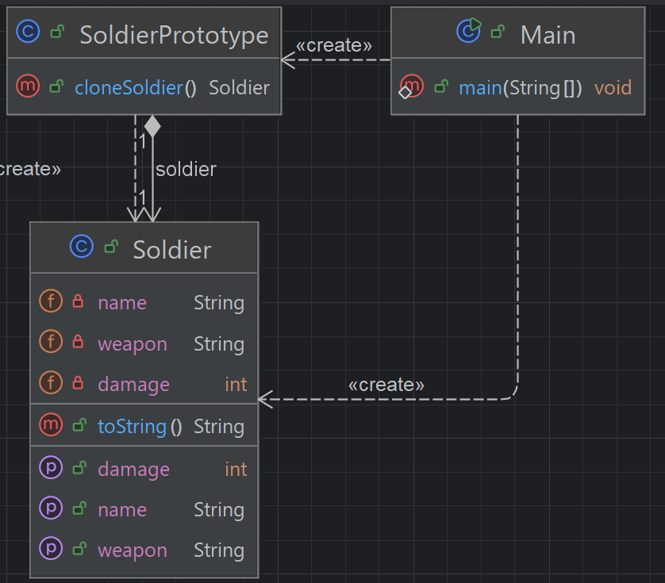

## 개요
기존 객체를 복제해서 새 객체를 생성하는 패턴  
new를 쓰지 않고 새로운 인스턴스를 만드는 것이 핵심  
Deep copy 로 복사하여 원본이 변경되지 않도록 하는것이 좋다.  
객체 생성 비용이 큰 경우 생성하면 좋음.(복잡한 초기화, DB 조회 등)

## 구조
### 예시 상황
게임에서 유닛을 생성할때 프로토타입으로 초기화를 한 후에 복사 하여 생성하는 예제이다.

### UML


### 코드
#### Soldier class
```java
public class Soldier {
    private String name;
    private int damage;
    private String weapon;

    public Soldier(String name, int damage, String weapon) {
        this.name = name;
        this.damage = damage;
        this.weapon = weapon;
    }

    public Soldier(Soldier other) {
        this.name = other.name;
        this.damage = other.damage;
        this.weapon = other.weapon;
    }

    public void setName(String name) {
        this.name = name;
    }

    public void setDamage(int damage) {
        this.damage = damage;
    }

    public void setWeapon(String weapon) {
        this.weapon = weapon;
    }

    @Override
    public String toString() {
        return "Soldier{" +
                "name='" + name + '\'' +
                ", damage=" + damage +
                ", weapon='" + weapon + '\'' +
                '}';
    }
}
```

#### SoldierPrototype class
```java
public class SoldierPrototype {
    private Soldier soldier;

    public SoldierPrototype(Soldier soldier) {
        this.soldier = soldier;
    }

    public Soldier cloneSoldier() {
        return new Soldier(soldier);
    }
}
```

#### Main class
```java
public class Main {
        public static void main(String[] args) {
        Soldier template = new Soldier("Template", 10, "Spear");
        SoldierPrototype prototype = new SoldierPrototype(template);

        Soldier swordMan = prototype.cloneSoldier();
        swordMan.setName("SwordMan");
        swordMan.setDamage(5);
        swordMan.setWeapon("Sword");

        Soldier bowMan = prototype.cloneSoldier();
        bowMan.setName("BowMan");
        bowMan.setDamage(4);
        bowMan.setWeapon("Bow");

        System.out.println(template.toString());
        System.out.println(swordMan.toString());
        System.out.println(bowMan.toString());

        /***
         * Soldier{name='Template', damage=10, weapon='Spear'}
         * Soldier{name='SwordMan', damage=5, weapon='Sword'}
         * Soldier{name='BowMan', damage=4, weapon='Bow'}
         */
    }
}
```

## 마무리
생성 비용이 높은 객체를 미리 생성하여 생성된 객체를 복사하여 생성하는 패턴이다.  
그다지 어려운 개념은 아닌듯