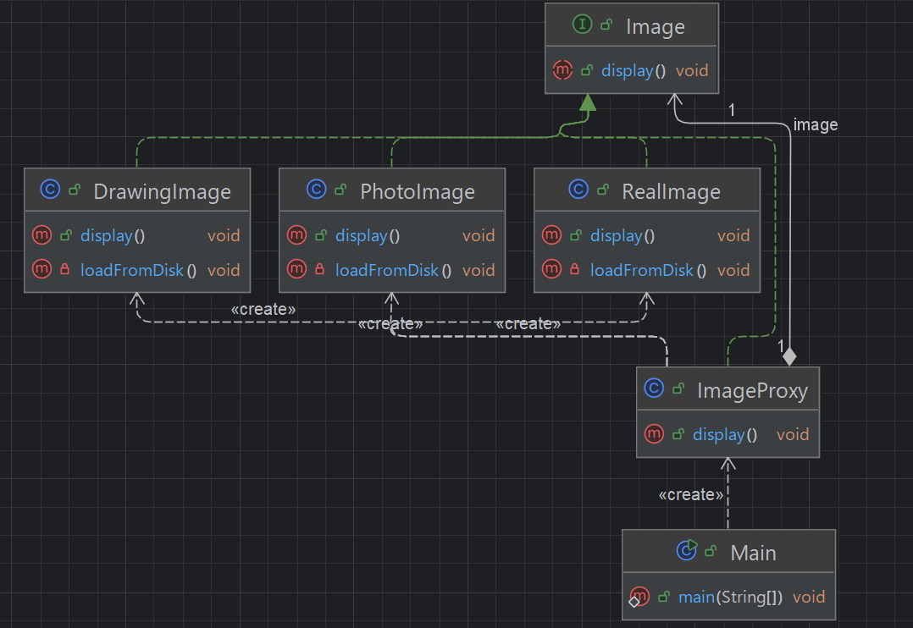

## 개요
어떤 객체에 직접 접근 하지 않고 그 객체를 대신해서 행동하는 대리객체(프록시)를 두는 패턴.  
원래 객체가 지연 로딩, 접근 제어등을 위해 중간에 끼는 객체가 존재.  
  
지연 로딩:	무거운 객체를 나중에 필요할 때 생성  
접근 제어:	권한이 있어야 접근 가능하게 하기  
로깅/모니터링:	진짜 객체 실행 전후로 로그 찍기  
네트워크 프록시:	원격 객체 대신 요청 처리 (RMI, WebService 등)

## 구조
### 예시 상황
이미지를 출력하는 예시이다.  
프록시 객체가 가지고 있다가 실제로 해당 객체를 생성 해야 할 시점에서야 생성한다.  
여기에서는 지연 로딩을 예시로 들고 있고, 이미 생성된 객체는 캐싱이 되어 있는 상태이기에 객체 생성없이 바로 실행이 가능하다.

### UML


### 코드
#### Image interface
```java
public interface Image {
    void display();
}
```

#### ImageProxy class
```java
public class ImageProxy implements Image {
    private Image image;
    private String fileName;
    public ImageProxy(String fileName) {
        this.fileName = fileName;
    }

    @Override
    public void display() {
        if (image == null) {
            if (fileName.endsWith(".jpg") || fileName.endsWith(".png")) {
                image = new PhotoImage(fileName);
            } else if (fileName.endsWith(".svg")) {
                image = new DrawingImage(fileName);
            } else {
                image = new RealImage(fileName);
            }
        }
        image.display();
    }
}
```

#### PhotoImage class
```java
public class PhotoImage implements Image {
    private String filename;

    public PhotoImage(String filename) {
        this.filename = filename;
        loadFromDisk(); // 실제 로딩이 있다는 전제.
    }

    private void loadFromDisk() {
        System.out.println("Loading " + filename);
        try {
            Thread.sleep(1000);
        } catch (InterruptedException e) {
            throw new RuntimeException(e);
        }
    }

    @Override
    public void display() {
        System.out.println("Photo Displaying " + filename);
    }
}
```

#### DrawingImage class
```java
public class DrawingImage implements Image {
    private String filename;

    public DrawingImage(String filename) {
        this.filename = filename;
        loadFromDisk(); // 실제 로딩이 있다는 전제.
    }

    private void loadFromDisk() {
        System.out.println("Loading " + filename);
        try {
            Thread.sleep(500);
        } catch (InterruptedException e) {
            throw new RuntimeException(e);
        }
    }

    @Override
    public void display() {
        System.out.println("Drawing Displaying " + filename);
    }
}
```

#### RealImage class
```java
public class RealImage implements Image {
    private String filename;

    public RealImage(String filename) {
        this.filename = filename;
        loadFromDisk(); // 실제 로딩이 있다는 전제.
    }

    private void loadFromDisk() {
        try {
            Thread.sleep(500);
        } catch (InterruptedException e) {
            throw new RuntimeException(e);
        }
        System.out.println("Loading " + filename);
    }

    @Override
    public void display() {
        System.out.println("Real Displaying " + filename);
    }
}
```

#### Main class
```java
public class Main {
    public static void main(String[] args) {
        Image image1 = new ImageProxy("image1.jpg");
        Image image2 = new ImageProxy("image2.svg");

        System.out.println("이미지 출력");
        System.out.println("처음 출력");
        image1.display();
        System.out.println("두 번째 출력 (캐싱)");
        image1.display();

        System.out.println("이미지 출력");
        image2.display();

        /***
         * 이미지 출력
         * 처음 출력
         * Loading image1.jpg
         * Photo Displaying image1.jpg
         * 두 번째 출력 (캐싱)
         * Photo Displaying image1.jpg
         * 이미지 출력
         * Loading image2.svg
         * Drawing Displaying image2.svg
         */
    }
}
```

## 마무리
스프링을 이용하다보면 디비 객체등을 생성할때 보이는 패턴이다.  
스프링에선 프록시 객체로 여러객체를 프록시를 이용하여 생성하는 경우가 많다.  
솔직히 지연로딩과 접근제어 이외에는 감으로만 대충 그렇겠지라는 이해밖에 되지 않긴하다.