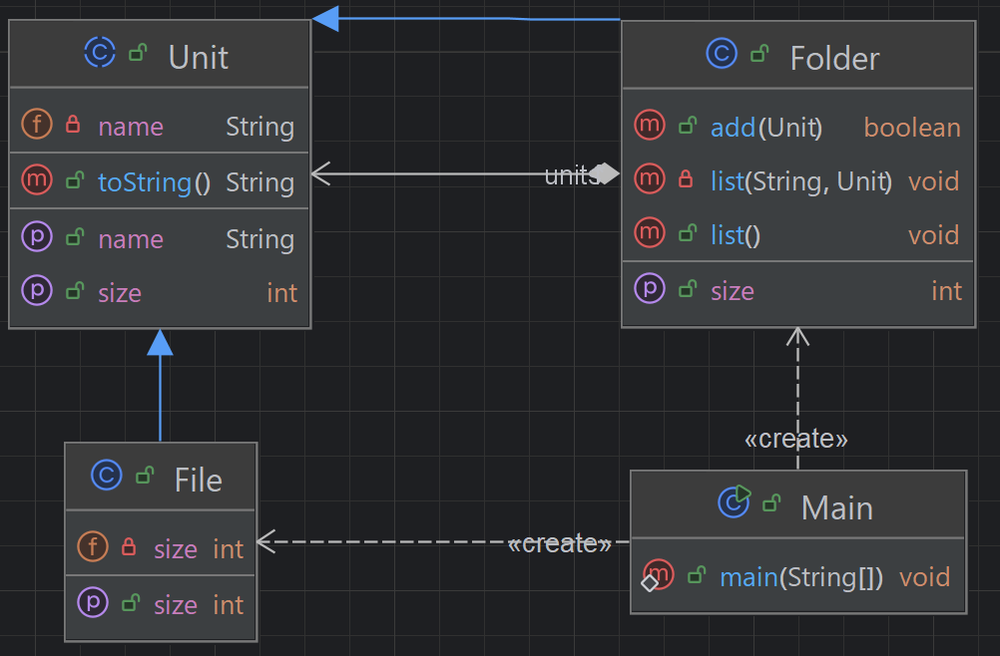

## 개요
개별 객체와 객체의 그룹을 동익한 방식으로 다룰 수 있도록 트리 구조록 구성하는 패턴.  
리눅스나 윈도우 등에서 사용하는 파일, 폴더 시스템을 생각하면 이해하기 쉽다.

## 구조
### 예시 상황
파일과 폴더의 구조이다.

### UML


### 코드
#### Unit abstract class
```java
public abstract class Unit {
    private String name;

    public Unit(String name) {
        this.name = name;
    }

    public String getName() {
        return name;
    }

    @Override
    public String toString() {
        return name + "(" + getSize() + ")";
    }

    public abstract int getSize();
}
```

#### Folder class
```java
public class Folder extends Unit{
    private LinkedList<Unit> units = new LinkedList<>();

    public Folder(String name) {
        super(name);
    }

    @Override
    public int getSize() {
        int size = 0;
        Iterator<Unit> iterator = units.iterator();
        while (iterator.hasNext()) {
            size += iterator.next().getSize();
        }
        return size;
    }

    public boolean add(Unit unit) {
        units.add(unit);
        return true;
    }

    private void list(String indent, Unit unit) {
        if (unit instanceof File) {
            System.out.println(indent + unit);
        } else {
            Folder dir = (Folder) unit;
            Iterator<Unit> iterator = dir.units.iterator();
            System.out.println(indent + "+ " + unit);
            while (iterator.hasNext()) {
                list(indent + "  ", iterator.next());
            }
        }
    }

    public void list() {
        list("", this);
    }
}
```

#### File class
```java
public class File extends Unit {

    private int size;

    public File(String name, int size) {
        super(name);
        this.size = size;
    }

    @Override
    public int getSize() {
        return size;
    }
}
```

#### Main class
```java
public class Main {
    public static void main(String[] args) {
        Folder root = new Folder("root");
        root.add(new File("a.txt", 1000));
        root.add(new File("b.txt", 2000));

        Folder folder1 = new Folder("folder1");
        root.add(folder1);
        folder1.add(new File("aa.txt", 100));
        Folder folder1Subfolder1 = new Folder("folder1Subfolder1");
        folder1.add(folder1Subfolder1);

        Folder folder2 = new Folder("folder2");
        root.add(folder2);
        folder2.add(new File("AA.txt", 200));
        folder2.add(new File("BB.txt", 250));

        root.list();

        /***
         * + root(3550)
         *   a.txt(1000)
         *   b.txt(2000)
         *   + folder1(100)
         *     aa.txt(100)
         *     + folder1Subfolder1(0)
         *   + folder2(450)
         *     AA.txt(200)
         *     BB.txt(250)
         */
    }
}
```

## 마무리
쓸 일이 많지는 않을 듯 하다.