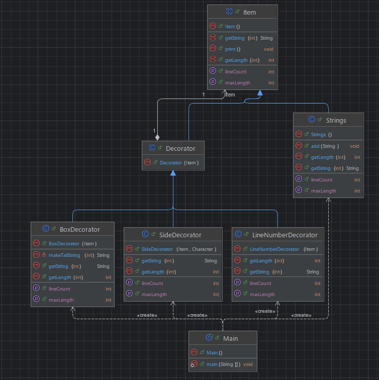

## 개요
기능을 장식처럼 계속 추가 할 수 있는 패턴.

## 구조
### 예시 상황
기본 텍스트에 따옴표를 추가하거나 넘버를 추가하는 등의 예시이다.

### UML


### 코드
#### Item abstract class
```java
public abstract class Item {
    public abstract int getLineCount();
    public abstract int getMaxLength();
    public abstract int getLength(int index);
    public abstract String getString(int index);

    public void print() {
        int cntLines = getLineCount();
        for (int i = 0; i < cntLines; i++) {
            String string = getString(i);
            System.out.println(string);
        }
    }
}
```

#### Decorator abstract class
```java
public abstract class Decorator extends Item {
    protected Item item;

    public Decorator(Item item) {
        this.item = item;
    }
}
```

#### Strings class
```java
public class Strings extends Item {
    private ArrayList<String> strings = new ArrayList<>();

    public void add(String item) {
        strings.add(item);
    }

    @Override
    public int getLineCount() {
        return strings.size();
    }

    @Override
    public int getMaxLength() {
        Iterator<String> iterator = strings.iterator();
        int maxWidth = 0;
        while (iterator.hasNext()) {
            String string = iterator.next();
            int windth = string.length();
            if (windth > maxWidth) {
                maxWidth = windth;
            }
        }
        return maxWidth;
    }

    @Override
    public int getLength(int index) {
        String string = strings.get(index);
        return string.length();
    }

    @Override
    public String getString(int index) {
        String string = strings.get(index);
        return string;
    }
}
```

#### BoxDecorator class
```java
public class BoxDecorator extends Decorator {

    public BoxDecorator(Item item) {
        super(item);
    }

    @Override
    public int getLineCount() {
        return item.getLineCount() + 2;
    }

    @Override
    public int getMaxLength() {
        return item.getMaxLength() + 2;
    }

    @Override
    public int getLength(int index) {
        return item.getLength(index) + 2;
    }

    @Override
    public String getString(int index) {
        int maxWidth = this.getMaxLength();
        if (index == 0 || index == getLineCount() - 1) {
            StringBuilder sb = new StringBuilder();
            sb.append('+');
            for (int i = 0; i < maxWidth - 2; i++) {
                sb.append('-');
            }
            sb.append('+');
            return sb.toString();
        } else {
            return '|' + item.getString(index-1)
                    + makeTailString(maxWidth - getLength(index-1));
        }
    }

    private String makeTailString(int count) {
        StringBuilder sb = new StringBuilder();
        for (int i = 0; i < count; i++) {
            sb.append(' ');
        }
        sb.append('|');
        return sb.toString();
    }
}
```

#### LineNumberDecorator class
```java
public class LineNumberDecorator extends Decorator {
    public LineNumberDecorator(Item item) {
        super(item);
    }

    @Override
    public int getLineCount() {
        return item.getLineCount();
    }

    @Override
    public int getMaxLength() {
        return item.getMaxLength() + 4;
    }

    @Override
    public int getLength(int index) {
        return item.getLength(index) + 4;
    }

    @Override
    public String getString(int index) {
        return String.format("%02d", index) + ": " + item.getString(index);
    }
}
```

#### SideDecorator class
```java
public class SideDecorator extends Decorator {
    private Character ch;

    public SideDecorator(Item item, Character ch) {
        super(item);
        this.ch = ch;
    }

    @Override
    public int getLineCount() {
        return item.getLineCount();
    }

    @Override
    public int getMaxLength() {
        return item.getMaxLength() + 2;
    }

    @Override
    public int getLength(int index) {
        return item.getLength(index) + 2;
    }

    @Override
    public String getString(int index) {
        return ch + item.getString(index) + ch;
    }
}
```

#### Main class
```java
public class Main {
    public static void main(String[] args) {
        Strings strings = new Strings();
        strings.add("Hello");
        strings.add("This is a DecoratorPattern.");
        strings.add("It's a pattern where functionalities are added like decorations—layer by layer.");
        strings.add("It's awesome.");

        strings.print();

        Item decorator = new SideDecorator(strings, '\"');
        decorator.print();
        decorator = new LineNumberDecorator(decorator); // 사이드 데코레이터에 라인넘버를 추가.
        decorator.print();
        decorator = new BoxDecorator(decorator); // 사이드 + 라인넘버추가된 곳에 박스 데코레이터를 추가.
        decorator.print();

        Item decorator2 = new BoxDecorator(strings);
        decorator2.print();
        decorator2 = new LineNumberDecorator(decorator2);
        decorator2.print();

        /***
         * Hello
         * This is a DecoratorPattern.
         * It's a pattern where functionalities are added like decorations—layer by layer.
         * It's awesome.
         * 
         * "Hello"
         * "This is a DecoratorPattern."
         * "It's a pattern where functionalities are added like decorations—layer by layer."
         * "It's awesome."
         * 
         * 00: "Hello"
         * 01: "This is a DecoratorPattern."
         * 02: "It's a pattern where functionalities are added like decorations—layer by layer."
         * 03: "It's awesome."
         * 
         * +-------------------------------------------------------------------------------------+
         * |00: "Hello"                                                                          |
         * |01: "This is a DecoratorPattern."                                                    |
         * |02: "It's a pattern where functionalities are added like decorations—layer by layer."|
         * |03: "It's awesome."                                                                  |
         * +-------------------------------------------------------------------------------------+
         * 
         * +-------------------------------------------------------------------------------+
         * |Hello                                                                          |
         * |This is a DecoratorPattern.                                                    |
         * |It's a pattern where functionalities are added like decorations—layer by layer.|
         * |It's awesome.                                                                  |
         * +-------------------------------------------------------------------------------+
         * 
         * 00: +-------------------------------------------------------------------------------+
         * 01: |Hello                                                                          |
         * 02: |This is a DecoratorPattern.                                                    |
         * 03: |It's a pattern where functionalities are added like decorations—layer by layer.|
         * 04: |It's awesome.                                                                  |
         * 05: +-------------------------------------------------------------------------------+
         */
    }
}
```

## 마무리
기존 처리에 새로운 기능을 덧붙여야 할때에 사용하면 좋을 듯 하다.