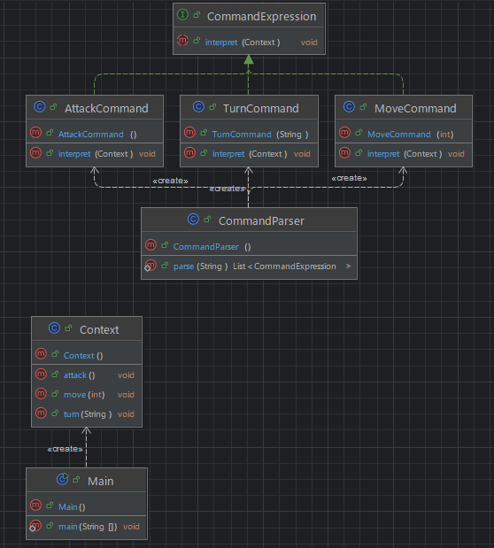

## 개요
스크립트나 표현식을 해석하여 그것을 클래스로 표현하여 사용하는 패턴.  
문자열을 해석하여 필요한 메서드를 실행 시킨다.  
일반적인 경우보다는 특수한 경우에 쓰임.

## 구조
### 예시 상황
텍스트 기반 게임을 예시로 이동, 회전, 공격에 해당 하는 문자열을 해석하여 해당 클래스를 실행 시킨다.

### UML


### 코드
#### CommandExpression interface
```java
public interface CommandExpression {
    void interpret(Context context);
}
```

#### AttackCommand class
```java
public class AttackCommand implements CommandExpression {
    @Override
    public void interpret(Context context) {
        context.attack();
    }
}
```

#### MoveCommand class
```java
public class MoveCommand implements CommandExpression {
    private final int steps;

    public MoveCommand(int steps) {
        this.steps = steps;
    }

    @Override
    public void interpret(Context context) {
        context.move(steps);
    }
}
```

#### TurnCommand class
```java
public class TurnCommand implements CommandExpression {
    private final String direction;

    public TurnCommand(String direction) {
        this.direction = direction;
    }

    @Override
    public void interpret(Context context) {
        context.turn(direction);
    }
}
```

#### CommandParser class
```java
public class CommandParser {
    public static List<CommandExpression> parse(String script) {
        List<CommandExpression> commands = new ArrayList<>();
        String[] lines = script.split("\\n");

        for (String line : lines) {
            String[] tokens = line.trim().split(" ");
            switch (tokens[0]) {
                case "MOVE" -> commands.add(new MoveCommand(Integer.parseInt(tokens[1])));
                case "TURN" -> commands.add(new TurnCommand(tokens[1]));
                case "ATTACK" -> commands.add(new AttackCommand());
                default -> System.out.println("알 수 없는 명령: " + tokens[0]);
            }
        }

        return commands;
    }
}
```

#### Context class
```java
public class Context {
    public void move(int steps) {
        System.out.println(steps + "칸 앞으로 이동");
    }

    public void turn(String direction) {
        System.out.println(direction.equals("LEFT") ? "왼쪽으로 회전" : "오른쪽으로 회전");
    }

    public void attack() {
        System.out.println("공격 실행");
    }
}
```

#### Main class
```java
public class Main {
    public static void main(String[] args) {
        String script = """
                MOVE 3
                TURN LEFT
                ATTACK
                """;
        Context context = new Context();
        List<CommandExpression> commands = CommandParser.parse(script);

        for (CommandExpression cmd : commands) {
            cmd.interpret(context);
        }

        /***
         * 3칸 앞으로 이동
         * 왼쪽으로 회전
         * 공격 실행
         */
    }
}
```

## 마무리
실제로 사용될 일은 없을 거 같지만 쿼리 해석과 같은 특수한 상황일때 고려해 볼만 할 것 같다.