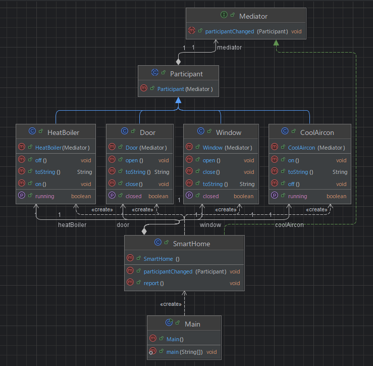

## 개요
Mediator는 중재재자라는 뜻이다.  
객체의 상태가 다른 객체에게 영향을 주어 같이 변경이 되어야 할 경우 중재재자를 두어서 일괄적으로 관리하는 패턴이다.  
서로가 서로에게 영향을 끼칠때에 사용한다.

## 구조
### 예시 상황
에어컨, 히터, 문, 창문을 제어하는 예시이며, 에어컨이 켜지면 문과 창문을 닫고 히터가 꺼지는 등과 같은 상호작용을 한다.

### UML


### 코드
#### Mediator interface
```java
public interface Mediator {
    void participantChanged(Participant participant);
}
```

#### SmartHome class
```java
public class SmartHome implements Mediator {

    public Door door = new Door(this);
    public Window window = new Window(this);
    public HeatBoiler heatBoiler = new HeatBoiler(this);
    public CoolAircon coolAircon = new CoolAircon(this);

    @Override
    public void participantChanged(Participant participant) {
        if (participant == door && !door.isClosed()) {
            coolAircon.off();
            heatBoiler.off();
        }

        if (participant == window && !window.isClosed()) {
            coolAircon.off();
            heatBoiler.off();
        }

        if (participant == heatBoiler && heatBoiler.isRunning()) {
            coolAircon.off();
            window.close();
            door.close();
        }

        if (participant == coolAircon && coolAircon.isRunning()) {
            heatBoiler.off();
            window.close();
            door.close();
        }
    }

    public void report() {
        System.out.println("\033[H\033[2J[Home status]");
        System.out.println(door);
        System.out.println(window);
        System.out.println(coolAircon);
        System.out.println(heatBoiler);
    }
}
```

#### Participant abstract class
```java
public abstract class Participant {
    protected Mediator mediator;

    public Participant(Mediator mediator) {
        this.mediator = mediator;
    }
}
```

#### Door class
```java
public class Door extends Participant {
    private boolean bClosed = true;

    public Door(Mediator mediator) {
        super(mediator);
    }

    public void open() {
        if (!bClosed) return;
        bClosed = false;
        mediator.participantChanged(this);
    }

    public void close() {
        if (bClosed) return;
        bClosed = true;
        mediator.participantChanged(this);
    }

    public boolean isClosed() {
        return bClosed;
    }

    @Override
    public String toString() {
        if (bClosed) return "# Door is closed";
        else return "# Door is open";
    }
}
```

#### Window class
```java
public class Window extends Participant {
    private boolean bClosed = true;

    public Window(Mediator mediator) {
        super(mediator);
    }

    public void open() {
        if (!bClosed) return;
        bClosed = false;
        mediator.participantChanged(this);
    }

    public void close() {
        if (bClosed) return;
        bClosed = true;
        mediator.participantChanged(this);
    }

    public boolean isClosed() {
        return bClosed;
    }

    @Override
    public String toString() {
        if (bClosed) return "# Window is closed";
        else return "# Window is open";
    }
}
```

#### CoolAircon class
```java
public class CoolAircon extends Participant {
    private boolean bOff = true;

    public CoolAircon(Mediator mediator) {
        super(mediator);
    }

    public void on() {
        if (!bOff) return;
        bOff = false;
        mediator.participantChanged(this);
    }

    public void off() {
        if (bOff) return;
        bOff = true;
        mediator.participantChanged(this);
    }

    public boolean isRunning() {
        return !bOff;
    }

    @Override
    public String toString() {
        if (bOff) return "# Aircon is off";
        else return "# Aircon is on";
    }
}
```

#### HeatBoiler class
```java
public class HeatBoiler extends Participant {
    private boolean bOff = true;

    public HeatBoiler(Mediator mediator) {
        super(mediator);
    }

    public void on() {
        if (!bOff) return;
        bOff = false;
        mediator.participantChanged(this);
    }

    public void off() {
        if (bOff) return;
        bOff = true;
        mediator.participantChanged(this);
    }

    public boolean isRunning() {
        return !bOff;
    }

    @Override
    public String toString() {
        if (bOff) return "# Boiler is off";
        else return "# Boiler is on";
    }
}
```

#### Main class
```java
public class Main {
    public static void main(String[] args) {
        SmartHome smartHome = new SmartHome();
        try (Scanner scanner = new Scanner(System.in)) {
            do {
                smartHome.report();
                int i = scanner.nextInt();

                if (i == 1) smartHome.door.open();
                else if (i == 2) smartHome.door.close();
                else if (i == 3) smartHome.window.open();
                else if (i == 4) smartHome.window.close();
                else if (i == 5) smartHome.coolAircon.on();
                else if (i == 6) smartHome.coolAircon.off();
                else if (i == 7) smartHome.heatBoiler.on();
                else if (i == 8) smartHome.heatBoiler.off();
            } while (true);
        }

        /***
         * [Home status]
         * # Door is open
         * # Window is open
         * # Aircon is off
         * # Boiler is off
         * 5
         * [Home status]
         * # Door is closed
         * # Window is closed
         * # Aircon is on
         * # Boiler is off
         * 7
         */
    }
}
```

## 마무리
서로 상호작용이 필요할때 사용하면 좋을 듯 하다.  
게임을 예를 들면 미스테리 추리 게임등에서 트리거를 활용해야 할때 고려하는 등을 상상해 볼 수 있다.