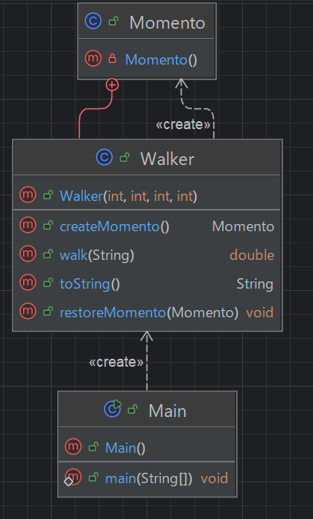

## 개요
객체의 상태를 기억해 두었다가 필요 할 때 기억해둔 상태로 객체를 되돌린다.  
객체는 다른 객체에서 읽을 수 있지만 읽기 전용이어야 한다.  
객체의 상태에 대한 기억에 대한 생성은 오직 해당 객체만 할 수 있게 해야한다.

## 구조
### 예시 상황
랜덤하게 걸어서 distance가 0이 되면 종료한다.  
해당 행위는 랜덤으로 진행되며 목표에 가까워질때 저장한다.

### UML


### 코드
#### Walker class
```java
public class Walker {
    private int currentX, currentY;
    private int targetX, targetY;
    private ArrayList<String> actionList = new ArrayList<>();

    public Walker(int currentX, int currentY, int targetX, int targetY) {
        this.currentX = currentX;
        this.currentY = currentY;
        this.targetX = targetX;
        this.targetY = targetY;
    }

    public double walk(String action) {
        actionList.add(action);

        if (action.equals("UP")) {
            currentY++;
        } else if (action.equals("RIGHT")) {
            currentX++;
        } else if (action.equals("DOWN")) {
            currentX--;
        } else if (action.equals("LEFT")) {
            currentX--;
        }

        // 유클리드 2차원 거리 공식
        return Math.sqrt(Math.pow(currentX - targetX, 2) + Math.pow(currentY - targetY, 2));
    }

    public class Momento {
        private int x, y;
        private ArrayList<String> actionList;
        private Momento(){}
    }

    public Momento createMomento() {
        Momento momento = new Momento();

        momento.x = this.currentX;
        momento.y = this.currentY;
        momento.actionList = (ArrayList<String>) this.actionList.clone();

        return momento;
    }

    public void restoreMomento(Momento momento) {
        this.currentX = momento.x;
        this.currentY = momento.y;
        this.actionList = (ArrayList<String>) momento.actionList.clone();
    }

    @Override
    public String toString() {
        return actionList.toString();
    }
}
```

#### Main class
```java
public class Main {
    public static void main(String[] args) {
        Walker walker = new Walker(0, 0, 10, 10);
        String[] actions = {"UP", "DOWN", "LEFT", "RIGHT"};
        Random rand = new Random();
        double minDistance = Double.MAX_VALUE;
        Walker.Momento momento = null;

        while (true) {
            String action = actions[rand.nextInt(4)];
            double distance = walker.walk(action);
            System.out.println(action + " " + distance);

            if (distance == 0.0) {
                break;
            }

            if (minDistance > distance) {
                minDistance = distance;
                momento = walker.createMomento();
            } else {
                if (momento != null) {
                    walker.restoreMomento(momento);
                }
            }
        }

        System.out.println("Walker's path: " + walker);

        /***
         * DOWN 14.866068747318506
         * DOWN 15.620499351813308
         * LEFT 15.620499351813308
         * LEFT 15.620499351813308
         * RIGHT 14.142135623730951
         * LEFT 14.866068747318506
         * UP 13.45362404707371
         * LEFT 14.212670403551895
         * RIGHT 12.727922061357855
         * UP 12.041594578792296
         * DOWN 12.806248474865697
         * UP 11.40175425099138
         * DOWN 12.206555615733702
         * RIGHT 10.63014581273465
         * RIGHT 9.899494936611665
         * UP 9.219544457292887
         * RIGHT 8.48528137423857
         * UP 7.810249675906654
         * DOWN 8.602325267042627
         * DOWN 8.602325267042627
         * DOWN 8.602325267042627
         * RIGHT 7.0710678118654755
         * RIGHT 6.4031242374328485
         * DOWN 7.0710678118654755
         * DOWN 7.0710678118654755
         * UP 5.656854249492381
         * RIGHT 5.0
         * UP 4.242640687119285
         * RIGHT 3.605551275463989
         * LEFT 4.242640687119285
         * RIGHT 3.1622776601683795
         * UP 2.23606797749979
         * UP 1.4142135623730951
         * LEFT 2.23606797749979
         * LEFT 2.23606797749979
         * UP 1.0
         * UP 1.4142135623730951
         * UP 1.4142135623730951
         * RIGHT 0.0
         * Walker's path: [DOWN, RIGHT, UP, RIGHT, UP, UP, RIGHT, RIGHT, UP, RIGHT, UP, RIGHT, RIGHT, UP, RIGHT, UP, RIGHT, RIGHT, UP, UP, UP, RIGHT]
         */
    }
}
```

## 마무리
커맨드 패턴과 비슷하지만 모멘트 패턴은 객체의 상태를 저장하고 커맨드 패턴은 행위를 저장한다는 게 다르다.  
모멘트는 게임에서 세이브라고 보면 되고 커맨드 패턴은 undo라고 생각하면 될 거 같다.