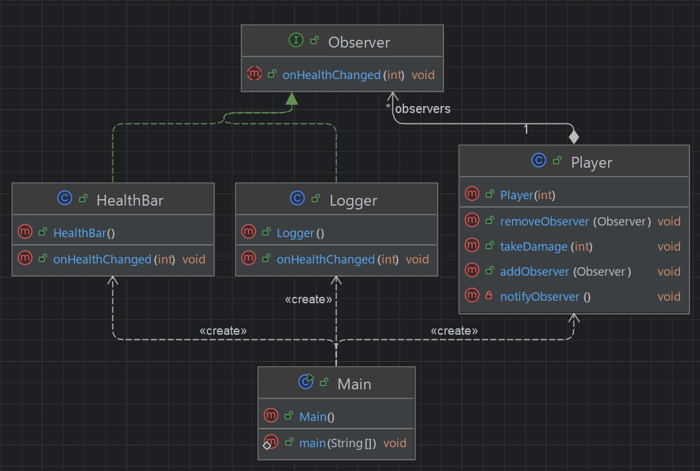

## 개요
subject가 관찰자(observer)에게 자신의 상태 변화를 알리는 패턴  
subject는 observer를 알지 못하거나 신호를 수신한 observer가 무엇을 하는지 신경 안씀.  
옵저버 패턴은 객체 간 일대다(1:N) 의존 관계를 정의하여, 한 객체의 상태 변화가 관련 객체에 자동으로 전파되도록 한다.  
즉, 어떤 객체의 상태가 변경되었을 때 그에 의존하는 객체들이 자동으로 알림을 받아 동기화가 되도록 하는 패턴.

## 구조
### 예시 상황
캐릭터가 데미지를 받았을 때 hp바에 반영되고 로거 객체가 로그를 출력해주는 예시이다.

### UML


### 코드
#### Observer interface
```java
public interface Observer {
    void onHealthChanged(int hp);
}
```

#### Player class
```java
public class Player {
    private List<Observer> observers = new ArrayList<Observer>();
    private int hp;

    public Player(int hp) {
        this.hp = hp;
    }

    public void takeDamage(int damage) {
        hp -= damage;
        notifyObserver();
    }

    public void addObserver(Observer observer) {
        observers.add(observer);
    }

    public void removeObserver(Observer observer) {
        observers.remove(observer);
    }

    private void notifyObserver() {
        for (Observer observer : observers) {
            observer.onHealthChanged(hp);
        }
    }
}
```

#### HealthBar class
```java
public class HealthBar implements Observer {

    @Override
    public void onHealthChanged(int hp) {
        System.out.println("HealthBar health: " + hp);
    }
}
```

#### Logger class
```java
public class Logger implements Observer {

    @Override
    public void onHealthChanged(int hp) {
        System.out.println(hp);
    }
}
```

#### Main class
```java
public class Main {
    public static void main(String[] args) {
        Player player = new Player(100);
        HealthBar healthBar = new HealthBar();
        player.addObserver(healthBar);

        Logger logger = new Logger();
        player.addObserver(logger);

        player.takeDamage(5);
        player.takeDamage(15);

        /***
         * HealthBar health: 95
         * 95
         * HealthBar health: 80
         * 80
         */
    }
}
```

## 마무리
스타크래프트의 그 옵저버가 맞다.  
이름과 행위만 보면 웹 훅처럼 풀링하는 구조로 보이지만 그건 아니고 객체가 옵저버를 호출하는 구조이긴하다.