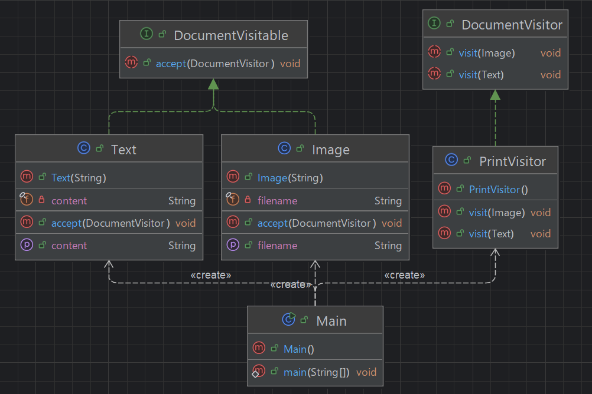

## 개요
데이터 구조와 데이터 처리를 분리해주는 패턴.  
데이터는 그대로 두고, 동작만 외부에서 덧붙이고 싶을 때 사용하는 패턴  
데이터 처리 방식을 기존의 소스 코드 변경 없이 새로운 클래스 추가만으로 확장 할 수 있음.  
데이터 구조는 고정하고 처리만 유연하게 확장하고 싶을때 사용하는 패턴.

## 구조
### 예시 상황
DocumentVisitable라는 자료구조가 있고 해당 객체의 이름을 출력하는데 text라면 앞에 텍스트가 붙고 image라면 앞에 이미지 파일이라는 단어가 붙으면서 프린트하는 예시이다.

### UML


### 코드
#### DocumentVisitable interface
```java
public interface DocumentVisitable {
    void accept(DocumentVisitor visitor);
}
```

#### DocumentVisitor interface
```java
public interface DocumentVisitor {
    void visit(Text text);
    void visit(Image image);
}
```

#### Text class
```java
public class Text implements DocumentVisitable {
    private final String content;

    public Text(String content) {
        this.content = content;
    }

    public String getContent() {
        return content;
    }

    @Override
    public void accept(DocumentVisitor visitor) {
        visitor.visit(this);
    }
}
```

#### Image class
```java
public class Image implements DocumentVisitable {
    private final String filename;

    public Image(String filename) {
        this.filename = filename;
    }

    public String getFilename() {
        return filename;
    }

    @Override
    public void accept(DocumentVisitor visitor) {
        visitor.visit(this);
    }
}
```

#### PrintVisitor class
```java
public class PrintVisitor implements DocumentVisitor {
    @Override
    public void visit(Text text) {
        System.out.println("텍스트: " + text.getContent());
    }

    @Override
    public void visit(Image image) {
        System.out.println("이미지 파일: " + image.getFilename());
    }
}
```

#### Main class
```java
public class Main {
    public static void main(String[] args) {
        List<DocumentVisitable> parts = List.of(
                new Text("안녕하세요."),
                new Image("cat.jpg"),
                new Text("방문자"),
                new Text("디자인"),
                new Text("패턴!"),
                new Image("dog.jpg")
        );

        DocumentVisitor printer = new PrintVisitor();

        for (DocumentVisitable part : parts) {
            part.accept(printer);
        }

        /***
         * 텍스트: 안녕하세요.
         * 이미지 파일: cat.jpg
         * 텍스트: 방문자
         * 텍스트: 디자인
         * 텍스트: 패턴!
         * 이미지 파일: dog.jpg
         */
    }
}
```

## 마무리
커스텀한 자료구조에서 추가적인 기능을 덧붙이고 싶을때 사용하면 괜찮을거 같다.