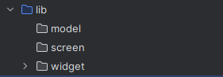

## 목표

```
 this is a goal
```

## 개발환경

| 이름 | 버전 | 비고 |
|---|---|---|
| SpringBoot | 3.0 | - |
| Oracle | 12g | - |

## 개요

개요입니다.

## 

## 코드

> 코틀린 코드입니다.


```kotlin
fun md(): String {
    return "Hello World"
}
```

## 결과



## 참고자료

* [ThemeData's accent properties have been deprecated](https://docs.flutter.dev/release/breaking-changes/theme-data-accent-properties)