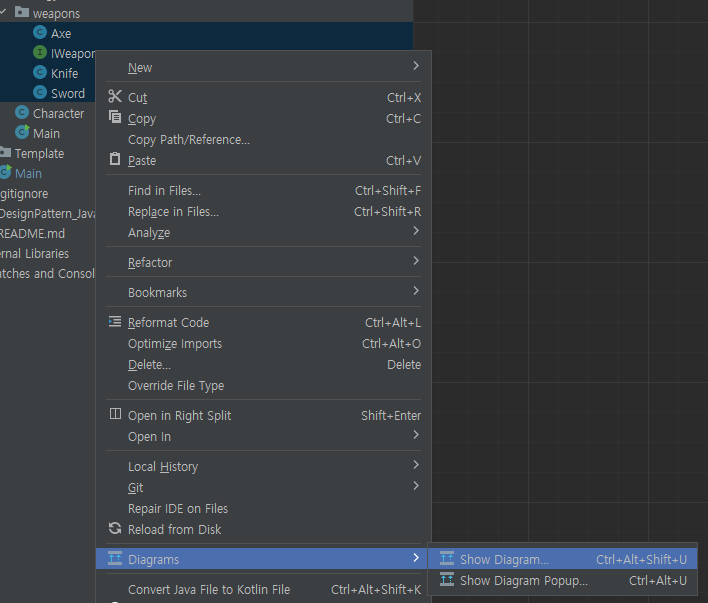
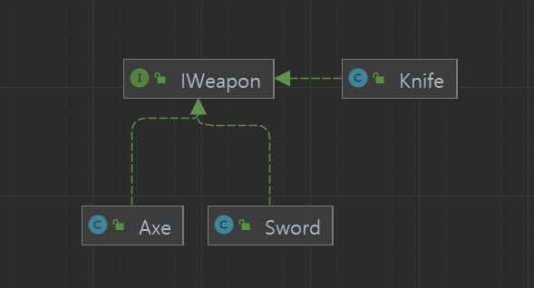
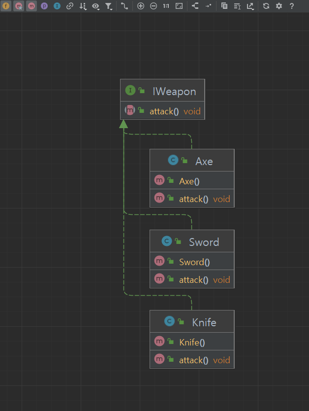
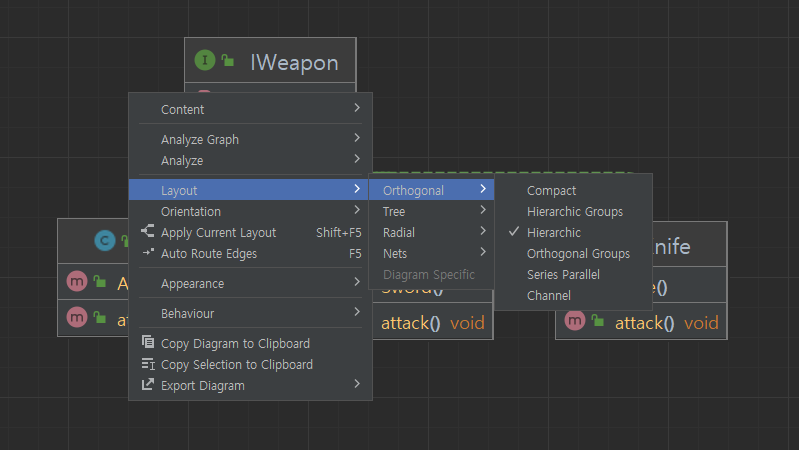

## 개요

---

종종 클래스 다이어그램을 확인하고 싶을떄가 있는데 이때 인텔리제이를 활용하면 간단히 볼 수 있다.

## Diagram 보기

---

좌측 프로젝트 -> 클래스 선택 -> 우 클릭 -> Diagrams -> Show Diagram 혹은 Show Diagram Popup

위의 순서대로 선택하면 별도의 창에 클래스 다이어그램이 완성된다.

다이어그램 윈도우 내 좌측 상단에 여러가지 버튼이 있는데 필드와 메소드 등을 추가 할 수 있다.

그리고 우클릭을 하면 여러 메뉴가 나오는데 Layout변경과 각종 분석 결과들을 볼 수 있다.

## 마무리

---

보통 클래스 설계를 하고 개발을 하겠지만 안되어 있는 곳도 많다.  
이때 인텔리제이의 기능을 이용하면 클래스들의 관계를 볼 수 있다.
