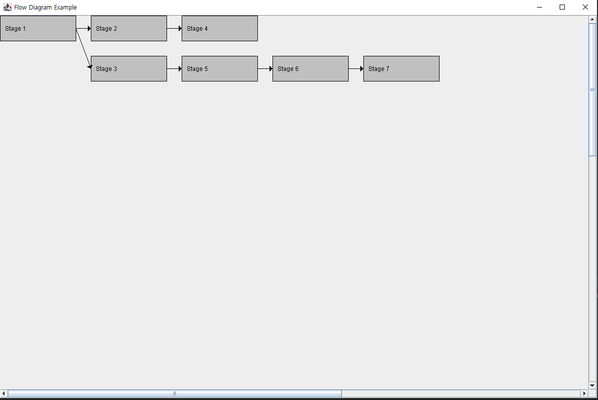

## 목표

```
자바스윙으로 플로 다이어그램을 그린다.
```

## 개발환경

| 이름 | 버전 | 비고 |
|---|---|---|
| Java | 17 | - |
| IntelliJ | 2024.1.4 (Ultimate Edition) | - |

## 개요

자바 gui를 이용해서 데이터 흐름도를 그린다.  
맵을 이용하여 위치 지정을 알기 쉽게 제작하였다.(부탁하였다.)

## 소스코드

### Main

```java
import javax.swing.*;

public class Main {
    public static void main(String[] args) {
        SwingUtilities.invokeLater(() -> {
            JFrame frame = new JFrame("Flow Diagram Example");
            frame.setDefaultCloseOperation(JFrame.EXIT_ON_CLOSE);
            frame.setSize(1200, 800);
            FlowDiagramPanel panel = new FlowDiagramPanel();
            JScrollPane scrollPane = new JScrollPane(panel);
            frame.add(scrollPane);
            frame.setVisible(true);

            // 예시 단계 및 화살표 추가
            panel.addStage("Stage 1", 0, 0);
            panel.addStage("Stage 2", 1, 0);
            panel.addStage("Stage 4", 2, 0);
            panel.addStage("Stage 3", 1, 1);
            panel.addStage("Stage 5", 2, 1);
            panel.addStage("Stage 6", 3, 1);
            panel.addStage("Stage 7", 4, 1);

            panel.addArrow("Stage 1", "Stage 2");
            panel.addArrow("Stage 2", "Stage 4");
            panel.addArrow("Stage 1", "Stage 3");
            panel.addArrow("Stage 3", "Stage 5");
            panel.addArrow("Stage 5", "Stage 6");
            panel.addArrow("Stage 6", "Stage 7");

            panel.revalidate();
            panel.repaint();
        });
    }
}
```

### FlowDiagramPanel

```java
import javax.swing.*;
import java.awt.*;
import java.util.HashMap;
import java.util.Map;

public class FlowDiagramPanel extends JPanel {
    private final Map<String, Rectangle> stages;
    private final java.util.List<Arrow> arrows;
    private final int stageWidth = 150;
    private final int stageHeight = 50;
    private final int margin = 30;

    public FlowDiagramPanel() {
        this.stages = new HashMap<>();
        this.arrows = new java.util.ArrayList<>();
        setPreferredSize(new Dimension(2000, 2000));  // 스크롤을 위한 큰 크기 설정
    }

    public void addStage(String name, int col, int row) {
        int x = col * (stageWidth + margin);
        int y = row * (stageHeight + margin);
        stages.put(name, new Rectangle(x, y, stageWidth, stageHeight));
    }

    public void addArrow(String from, String to) {
        arrows.add(new Arrow(from, to));
    }

    @Override
    protected void paintComponent(Graphics g) {
        super.paintComponent(g);
        Graphics2D g2d = (Graphics2D) g;

        // 단계 그리기
        for (Map.Entry<String, Rectangle> entry : stages.entrySet()) {
            Rectangle rect = entry.getValue();
            drawStage(g2d, entry.getKey(), rect.x, rect.y, rect.width, rect.height);
        }

        // 화살표 그리기
        for (Arrow arrow : arrows) {
            Rectangle fromRect = stages.get(arrow.from);
            Rectangle toRect = stages.get(arrow.to);
            if (fromRect != null && toRect != null) {
                drawArrow(g2d, fromRect.x + stageWidth, fromRect.y + stageHeight / 2, toRect.x, toRect.y + stageHeight / 2);
            }
        }
    }

    private void drawStage(Graphics2D g2d, String text, int x, int y, int width, int height) {
        g2d.setColor(Color.LIGHT_GRAY);
        g2d.fillRect(x, y, width, height);
        g2d.setColor(Color.BLACK);
        g2d.drawRect(x, y, width, height);
        g2d.drawString(text, x + 10, y + 30);
    }

    private void drawArrow(Graphics2D g2d, int x1, int y1, int x2, int y2) {
        g2d.setColor(Color.BLACK);
        g2d.drawLine(x1, y1, x2, y2);
        int arrowSize = 6;
        int dx = x2 - x1, dy = y2 - y1;
        double D = Math.sqrt(dx*dx + dy*dy);
        double xm = D - arrowSize, xn = xm, ym = arrowSize, yn = -arrowSize, x;
        double sin = dy / D, cos = dx / D;

        x = xm*cos - ym*sin + x1;
        ym = xm*sin + ym*cos + y1;
        xm = x;

        x = xn*cos - yn*sin + x1;
        yn = xn*sin + yn*cos + y1;
        xn = x;

        int[] xpoints = {x2, (int) xm, (int) xn};
        int[] ypoints = {y2, (int) ym, (int) yn};

        g2d.fillPolygon(xpoints, ypoints, 3);
    }

    static class Arrow {
        String from;
        String to;

        Arrow(String from, String to) {
            this.from = from;
            this.to = to;
        }
    }
}

```

## 결과



## 참고자료

ChatGpt 4o